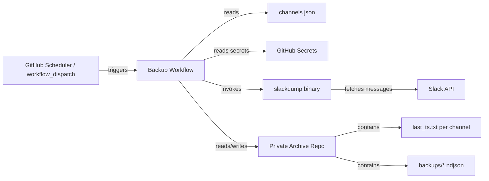
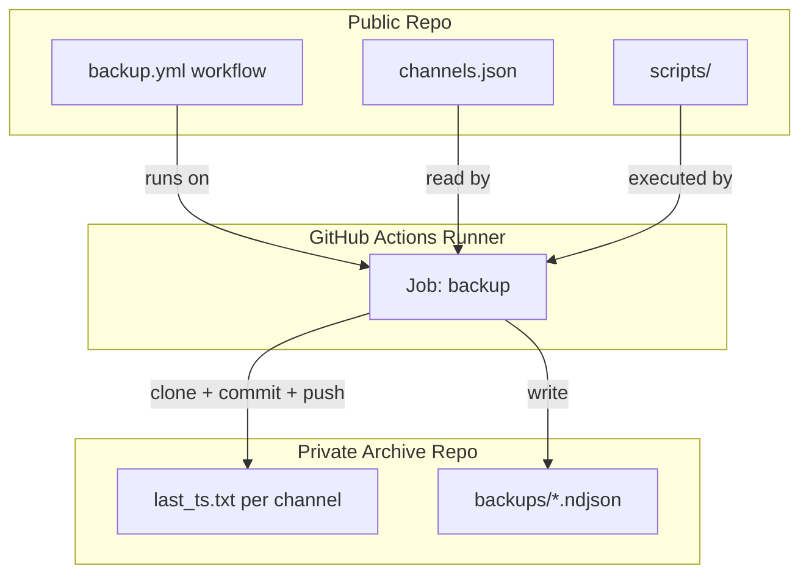

# DESIGN — Slack Backup

## Solution Strategy

GitHub Actions provides a free, forkable scheduler and runner requiring no external infrastructure. GitHub itself is both the host and the storage backend: a `schedule:` cron trigger (plus manual `workflow_dispatch` for full re-sync) runs the backup on a GitHub-hosted runner, and the fetched data is committed straight into a private GitHub repo — no server, database, or third-party storage to provision or operate. slackdump handles Slack export via browser session cookies, eliminating the need for OAuth apps or admin tokens. Splitting configuration into a public repo and backup output into a private repo isolates credentials without complicating the fork workflow. NDJSON is retained as-is from slackdump — no conversion step, no data loss risk, and line-oriented format suits incremental append patterns.

This project's scope is extraction and durable storage only — see CONTEXT.md Non-Goals. Search and analysis of the archived data are explicitly out of scope and left to a later, separate project.

---

## Runtime Architecture

---

## Building Block View

### Level 1 — System Overview

| Component | Responsibility |
|-----------|---------------|
| `.github/workflows/backup.yml` | Orchestrates trigger, secret injection, slackdump install, channel loop, commit and push to archive repo |
| `channels.json` | Declares channel IDs and slugs; sole configuration source for which channels are backed up |
| `scripts/install-slackdump.sh` | Downloads and verifies the slackdump binary at a pinned version |
| `scripts/incremental-dump.sh` | Reads last_ts.txt, calculates timestamp range, invokes slackdump, writes ndjson output, updates last_ts.txt |
| Private archive repo | Stores ndjson backup files and last_ts.txt state; never cloned publicly; accessed via PAT |

---

## Deployment View

---

## Crosscutting Concepts

### Secrets Management

All credentials are stored as GitHub repository secrets on the public repo. The session file is base64-encoded to survive GitHub's secret handling of multiline values. Secrets are injected as environment variables into the workflow job; they are never written to any file in either repo.

### State Management

`last_ts.txt` in the private archive repo root tracks the Unix timestamp of the most recently archived message per channel (one file per channel, named `<channel-slug>-last_ts.txt`). Absence of the file triggers a full dump on first run. The file is updated only after a successful slackdump invocation and before the final git commit.

### TDD Test Plan

Red phase — tests written before implementation. Not yet implemented.

**E2E Acceptance Tests** (run in workflow against mock):
1. Incremental logic: stub slackdump → verify only messages after last_ts.txt timestamp are requested (check CLI args)
2. Multi-channel: verify exactly N ndjson files created for N-channel channels.json
3. Commit/push: verify git detects changes and pushes to mock private repo

**Unit Tests** (`scripts/`):
1. `parse_channels`: validate channels.json schema — array of objects with `id` (string) and `name` (string) fields
2. `calc_ts_range`: given a last_ts.txt value and current time, verify dump-from and dump-to args match expected values; verify absent file produces a full-dump invocation

---

## Known Gaps & Recommendations

Identified during a design review against `../DevStandard` SDLC/ATDD standards and the current (v4.4.0) capabilities of slackdump. Scoped to the project's actual goal — reliable, lossless extraction and storage; search/analysis is out of scope (see CONTEXT.md Non-Goals).

### P1 — Address before further implementation

| Gap | Assessment | Recommendation |
|-----|-----------|-----------------|
| Bespoke incremental logic duplicates a slackdump built-in | slackdump natively supports resuming a previous archive (adding only new messages), built for the exact 90-day free-workspace constraint this project targets. `scripts/incremental-dump.sh` + `last_ts.txt` reimplements that logic in custom shell, which is the highest-risk, least-tested part of the design (timestamp/timezone edge cases, partial-failure corruption) for a problem the upstream tool already handles and tests. | **In progress:** `SlackBackup-d3r` spike created to evaluate slackdump's native resume mode against UC-1/UC-2; `SlackBackup-4i2` now depends on it and may be closed/superseded rather than implemented. |
| E2E test plan mocks the external boundary | DESIGN.md's TDD Test Plan stubs slackdump for E2E tests. DevStandard `sdlc-testing-principles.md` T14 prohibits mocking external platform boundaries — for a tool whose only job is "don't lose messages," the real slackdump↔Slack API boundary is exactly the thing that must be exercised for real. | Run the UC-1 (`4a8`) and UC-2 (`03m`) E2E tests against a real disposable test channel via the real slackdump binary, not a stub. UC-3 multi-channel fan-out (`c86`) and the JSON/timestamp unit tests (`jcf`) have no external boundary and are correctly scoped as-is — not changing those just for uniformity. |
| No idempotency / partial-failure-recovery test coverage | Rerunning after a partial failure (corrupt or stale `last_ts.txt`, interrupted commit) is the actual data-loss scenario this project exists to prevent, per T8 (idempotency) and T22 (risk-ordered coverage — destructive/data-loss paths before happy-path variants). The current test plan only covers happy-path incremental/multi-channel/commit checks. | Add one new scenario (not a battery of them): run the backup twice in sequence, including one run interrupted mid-write, against the real test channel, and assert no duplicate or missing messages. |
| Twin-track lifecycle (I2) not reflected in bd issues | All 9 open issues have empty descriptions/acceptance criteria and are sequenced waterfall-style (red-phase test issues block implementation issues) rather than DevStandard's twin-track `[IMP]`/`[TST]` pairs built in parallel against a shared pre-code contract (I4). | Add the I4 contract (entry-point signature, completion signal, output schema) to each issue's description before claiming it; restructure as parallel `[IMP]`/`[TST]` pairs if continuing to follow the framework strictly. |
| No ADRs recorded | `docs/adr/` is empty. Of the three candidate decisions, only the **public/private repo credential split** clearly earns an ADR on its own (real security tradeoff, costly to silently violate later). NDJSON-format-no-conversion is pending the `SlackBackup-d3r` spike outcome; wiz-only auth is a direct consequence of the "no admin access" constraint already in CONTEXT.md and would mostly restate it. | Hold off on ADRs until the spike resolves; reconsider whether an ADR is worth the overhead at all for a project this size, versus the credential-split ADR being the one clear exception. |

### P2 — Operational risks, lower urgency

| Gap | Assessment | Recommendation |
|-----|-----------|-----------------|
| No failure-alerting use case | Quality Goal #1 promises "no silent data loss," but slackdump's session cookie will eventually expire or be revoked (password change, periodic re-auth), and a scheduled job that just logs and exits on auth failure is silent from the operator's perspective. | Add a UC/AC: operator is notified (e.g. failed-run GitHub notification, or a check that fails loudly) when a scheduled run fails, not just "failure is logged." |
| GitHub Actions disables idle scheduled workflows | GitHub auto-disables `schedule:`-triggered workflows after 60 days with no repo activity — a real risk for a low-traffic personal fork. "Activity" is not human login — confirmed (GitHub Discussions, community reports) to mean repo-level events: commits/pushes, PRs, and issues. A second, independently-active GitHub project can keep this repo alive by using a PAT to push a real commit (or open/close an issue) on a schedule, which resets the clock. A *self-referencing* keepalive schedule in the same repo does not reliably bootstrap itself — if this repo's own scheduled triggers are ever disabled, that keepalive schedule is disabled along with everything else, so the reset has to come from outside. | **Mitigation adopted:** run the backup via local cron/scheduled task on the dev system instead of (or as a fallback to) GitHub Actions — this sidesteps the rule entirely, since there's no GitHub-side schedule to disable. Document this as the primary failure-mode mitigation in OPERATIONS.md once written. |
| `docs/OPERATIONS.md` does not exist yet | Failure modes, recovery procedures, and the alerting/dormancy items above have no home yet. | Create `docs/OPERATIONS.md` per this project's document map before implementing UC-1, so failure-mode behavior is specified alongside the happy path rather than added after the fact. |

---

## References

| Document | Location | Covers |
|----------|----------|--------|
| slackdump | https://github.com/rusq/slackdump | CLI flags, wiz auth, output format |
