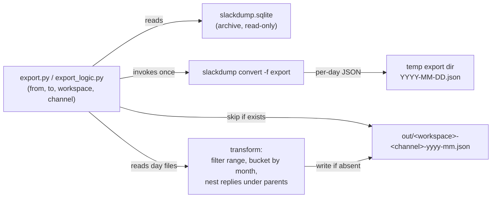

# DESIGN — Export Pipeline (`./slackbackup export ...`)

Companion to `docs/DESIGN.md` (the backup system that produces the archives this tool consumes).
This document covers **export only** — three read-only, derived products built from the durable
`slackdump.sqlite` archives (plus the catalog cache for two of them). None of the three ever
modifies the archive or makes a Slack API call; all three are implemented in
`src/slackbackup/export_logic.py`, wired to the CLI in `export.py`:

| Command | Covers below | Scope |
|---------|---------------|-------|
| `export monthly` | §Monthly Export | One channel, bounded date range, sealed/idempotent per-month files |
| `export digest` | §Digest Export | Many workspaces, trailing 180 days by default (or a different N), one merged chronological document |
| `export users` | §User Profiles Export | Full per-workspace user roster, not just digest posters |

---

## Monthly Export (`export monthly`)

### Solution Strategy

The backup system already commits one `slackdump.sqlite` per channel at
`<archive-root>/<workspace>/<channel-slug>/slackdump.sqlite` (see `docs/DESIGN.md` §State
Management). That database is the single source of truth — the exporter is a **read-only
consumer** of it and writes a separate output tree. It never calls the Slack API.

slackdump's own `convert` command already renders an archive to the **Slack Export** format —
a documented, version-stable structure of per-day JSON files (`YYYY-MM-DD.json`) carrying thread
metadata. Rather than couple to slackdump's *internal* SQLite schema (the `convert` help
explicitly describes that schema as internal and subject to change), the exporter reads through
that documented export boundary. This mirrors the project's existing lesson from the backup
side — lean on slackdump built-ins instead of reimplementing them (`resume` over a custom
incremental scheme).

The genuinely custom logic, which slackdump does not provide, is:

1. **Date-range bounding** — emit only messages whose timestamp falls in `[from, to]`.
2. **Monthly bucketing + naming** — one file per `(workspace, channel, year-month)`, named
   `workspace-channel-yyyy-mm.json`.
3. **Thread nesting** — replies nested *under* their parent message, not flat.
4. **Idempotent skip (sealed months only)** — if the target `workspace-channel-yyyy-mm.json`
   already exists, do not regenerate it — **except** the **trailing month** (the latest month
   that has any data in the archive), which is always rewritten because the archive may not yet
   hold all of that month's messages.

#### Approach decision

| Strategy | Read boundary | Decision |
|----------|---------------|----------|
| **A — Read `slackdump.sqlite` directly** | Internal, version-volatile schema (`MESSAGE.DATA` blobs, `THREAD_TS`, `IS_PARENT`) | Rejected as primary. Tightest coupling; the schema is documented by slackdump as internal. |
| **B — `slackdump convert -f export` → transform** *(chosen)* | Documented Slack Export format (per-day JSON, stable) | Chosen. slackdump owns the fragile sqlite→message decoding; the exporter owns only bucketing, nesting, naming, idempotency. |

Strategy A remains a fallback if a future slackdump release drops or changes `convert -f export`.

---

### Runtime Architecture



---

### Building Block View

#### Level 1 — System Overview

| Component | Responsibility |
|-----------|----------------|
| `export.py` (CLI) + `export_logic.build_digest`'s sibling `export_month`/`export_transform` (logic) | Parse args (`--from`, `--to`, `--workspace`, `--channel`, `--archive-root`, `--out`); locate the channel's `slackdump.sqlite`; orchestrate convert → transform → write. |
| `slackdump convert -f export` | Decode the SQLite archive into the documented Slack Export day-file layout in a temp dir. Owned by slackdump; not reimplemented. |
| Transform step | Read day files, drop out-of-range messages, group into month buckets keyed by the **parent** message's month, nest replies under their parent, emit one ordered JSON document per month. |
| Idempotency guard | Before writing `<workspace>-<channel>-yyyy-mm.json`, test for its existence; if present, skip without invoking the transform's write. |

#### Entry-point contract (I4)

```
./slackbackup export monthly --from YYYY-MM-DD --to YYYY-MM-DD \
                  --workspace <ws> --channel <slug> \
                  --archive-root <path> --out <dir>

  Input  : <archive-root>/<ws>/<slug>/slackdump.sqlite        (must exist)
           <archive-root>/<ws>/<slug>/.last_backup            (optional seal stamp)
  Output : <out>/<ws>-<slug>-YYYY-MM.json  for each month overlapping [from,to]
  Signal : exit 0 = every in-range month present on disk (written or pre-existing)
           exit 2 = archive not found for (workspace, channel)
  Stdout : one line per month — "wrote" | "rewrote (trailing month)"
                                 | "rewrote (late reply to sealed month)"
                                 | "skipped (exists)" | "empty (no messages)"
```

---

### Data Model

#### Input — Slack Export day file (from `slackdump convert`)

A `YYYY-MM-DD.json` file is a JSON **array** of Slack message objects for that calendar day.
Thread structure is *flat* in this format: a thread root and its replies all appear as
sibling array entries, related only by shared fields:

| Field | Meaning |
|-------|---------|
| `ts` | Message timestamp (`"1718990400.123456"`) — also the unique id and the sort key. |
| `thread_ts` | Present on a root **and** on each of its replies; equals the root's `ts`. Absent on non-threaded messages. |
| `reply_count`, `replies[]` | On the root only; slackdump's reply pointers. Not used for nesting — see below. |

#### Output — `<workspace>-<channel>-yyyy-mm.json`

A single JSON document per month:

```jsonc
{
  "workspace": "f3pugetsound",
  "channel":   "helpdesk",
  "month":     "2026-06",
  "range":     { "from": "2026-06-01", "to": "2026-06-30" },
  "generated": "2026-06-22T18:00:00Z",
  "messages": [
    {
      "ts": "1718...",
      "user": "U123",
      "display_name": "Jane Doe",
      "text": "parent message",
      "files": [ { "name": "report.pdf", "filetype": "pdf", "permalink": "https://..." } ],
      "replies": [
        { "ts": "1718...", "user": "U456", "display_name": "John Smith", "text": "nested reply" }
      ]
    },
    { "ts": "1718...", "user": "U789", "display_name": "U789", "text": "standalone, no replies key" }
  ]
}
```

Field reduction: each message (parent or reply) is projected down to `ts`, `user`, `display_name`,
`text`, and `files` (only present when the raw message had files) — Slack-API plumbing
(`blocks`, `client_msg_id`, `team`, `user_profile`, `metadata`, `reply_count`, `reply_users`,
`replace_original`, etc.) is dropped, since it's noise for an LLM analyzing conversations,
threads, links, and references. `display_name` is resolved from the `users.json` that
`slackdump convert -f export` writes alongside the day files (`profile.display_name`, falling
back to `real_name`, then `name`, then the raw `user` id if the user isn't in the map at all) —
`user` (the id) is always kept too, so messages stay cross-referenceable by id even though the
display name is what a reader/LLM will normally cite. A `files` entry is reduced to `name`,
`filetype`, and `permalink` (no thumbnails, internal URLs, or other file metadata).

Nesting rules:

- A message with no `thread_ts`, or whose `thread_ts == ts` and has no replies, is a top-level
  entry with no `replies` key.
- A reply (`thread_ts != ts`) is **removed** from the top level and appended to its parent's
  `replies` array, ordered by `ts`. Nesting is structural only — no field rewriting or lossy
  conversion beyond the field reduction above, which applies identically to parents and replies.
- `messages` and every `replies` array are sorted ascending by `ts`.

#### Bucketing rule (thread integrity)

A thread is assigned to **one** month — the month of its **parent** `ts` — even when replies
land in a later month. This keeps any single thread whole in one file rather than split across
two. Consequently a reply can appear in an *earlier* month file than its own timestamp; this is
intentional and documented here so consumers don't treat `replies[].ts` as bounded by the
file's month.

#### Date-range rule

`[from, to]` bounds which **threads** are emitted, evaluated against the **parent** `ts`. A
thread whose parent falls in range carries all its replies regardless of their individual
timestamps (consistent with the bucketing rule). Months that the range only partially covers
still produce a file, containing just the in-range threads for that month.

---

### Crosscutting Concepts

#### Idempotency

The unit of idempotency is the output **file**, with one exception: the **trailing month** is
always (re)written. The trailing month is the latest month that has any message in the archive
— *not* the wall-clock current month. It is computed from the archive's own high-water mark
(the max message `ts` across the converted day files), independent of the requested range.

A month is treated as **sealed** — safe to skip if its file exists — only when the archive
holds data in some *later* month. The existence of a later message proves the backup has
progressed past month M, so M can no longer gain messages. The trailing month has no later data
to seal it, so it is assumed potentially incomplete: this is the case where a backup is simply
overdue and more of that month's history may still arrive on the next backup run. Rewriting it
every export run keeps it correct without the operator having to reason about backup cadence.

For each **sealed** month, the tool still computes that month's messages (cheap — the single
per-run `convert` already paid the cost), then compares the result against the existing
`<out>/<workspace>-<channel>-yyyy-mm.json`; only if the content is unchanged is the write
skipped. This matters because **sealing is about new threads, not new replies**: a thread
parented in month M can receive a reply long after M is sealed and written (Slack threads don't
expire), and that reply must still land nested under its parent in M's file. Re-running with the
same or an overlapping range is a no-op for sealed months whose content truly hasn't changed, and
transparently reopens-and-rewrites a sealed month the moment a late reply to one of its threads
shows up — reported as `rewrote (late reply to sealed month)` rather than `skipped (exists)`. To
force regeneration of a sealed month for any other reason, delete its target file first.

#### Sealing signal — how we know a month is complete

"Sealed" needs a trustworthy predicate. Three are available, in increasing authority:

| # | Seal predicate for month M | Coupling / cost | Weakness |
|---|----------------------------|-----------------|----------|
| 1 | **Message high-water mark** — the archive holds a message in some month later than M. | None — uses only the converted day files. | A channel that has gone **quiet** never gets a later message, so its last active month is rewritten on every run forever and never stabilises. Harmless but wasteful, and that file is perpetually "provisional". |
| 2 | **Backup-completion stamp** *(implemented)* — a durable UTC timestamp the backup job writes after a successful `archive`/`resume`; M is sealed iff `last_backup > end_of_month(M)`. | `backup_logic._write_last_backup()` writes a `<channel-dir>/.last_backup` sidecar after each successful archive/resume. Git-durable (content, not mtime); no slackdump-internal coupling. | Archives written before the stamp existed have none (exporter falls back to (1) for those). |
| 3 | **slackdump internal fetch timestamp** — the chunk-recording time slackdump stamps inside `slackdump.sqlite`. | Couples to slackdump's internal schema — the exact coupling Strategy B exists to avoid. | Rejected for the same reason Strategy A was. |

**Decision:** use **(2) when the stamp is present, falling back to (1) when it is absent.** This
correctly seals a quiet channel's last active month as soon as a backup runs after that month
ends — directly handling the "we just haven't backed up yet, more data may arrive" case the
high-water mark alone gets wrong — while degrading gracefully on pre-stamp archives. (3) is
rejected: the same wall-clock catch-up time is obtainable from a sidecar we control without
binding to slackdump internals.

Why mtime is **not** used as the stamp: a file's modification time is reset to checkout time by
`git clone`/`git checkout`, so in the git-backed archive repo it would falsely seal or unseal
months after any fresh clone. The stamp must be file *content*, not filesystem metadata.

#### Read-only isolation

The exporter opens `slackdump.sqlite` only via `slackdump convert` (read path) and writes
exclusively under `--out`. It never touches the archive tree, so it can run concurrently with,
or independently of, the backup job without risking the data-loss footguns documented in
`docs/DESIGN.md` (the `archive`-over-existing and `-dedupe` bugs).

#### Test plan

**Fixture-based** (a small committed `slackdump.sqlite` or pre-converted day files — no Slack
boundary needed, this tool has none):

1. **Nesting** — a 1-root/2-reply thread produces one top-level message with a 2-element
   `replies` array in `ts` order; no reply leaks to top level.
2. **Cross-month thread** — root in month M, reply in M+1 → entire thread in the M file; the
   M+1 file does not contain the reply as a top-level message.
3. **Range bounding** — `--from/--to` inside a single month emits only in-range threads.
4. **Monthly split** — an archive spanning 3 months yields exactly 3 correctly-named files.
5. **Idempotency** — second run over the same range writes nothing and reports `skipped` for
   every month; pre-existing file bytes are unchanged.
6. **Naming** — output filename is exactly `<workspace>-<channel>-yyyy-mm.json` for the
   `(workspace, channel)` from the archive path.

**Boundary** (real slackdump binary):

7. `slackdump convert -f export` on a real archive yields the day-file layout the transform
   assumes (guards against a slackdump version drift breaking the read boundary — the chosen
   coupling point).

---

## Digest Export (`export digest`)

A single merged document covering the trailing 180 days by default (or a different N via
`--days`, or every message ever archived if a job sets `"days": null`) across every workspace
matching a glob or comma-separated selector list, intended as
direct LLM input (e.g. for a newsletter-generation prompt) — unlike `export monthly`'s many
small per-channel-month files, this is one document, one read.

```
./slackbackup export digest --archive-root <path> --channels-file ./channels.json \
    --workspace f3* [--days N] [--as-of YYYY-MM-DD] --out <file.json>
```

`--days` defaults to 180 (the trailing 180 days ending at `--as-of`). Pass `--days N` to scope it
to a different trailing window, or set a job's own `"days": null` to span everything ever archived
instead.

Best-effort across channels: a channel with no local archive is recorded with
`status: "missing_archive"` in the `channels` array rather than aborting the run — one
un-archived channel in a 100-channel workspace glob must not block the whole digest.

### Channel context — catalog, not a live call

Each channel's entry under `channels` is enriched with `description`/`creator`/`created_at`,
read **read-only from the already-cached catalog** (`catalog_logic.load`, never `refresh_*`) —
the digest stays purely local and never triggers a Slack API call of its own; if the cache was
never warmed for a channel (e.g. a fresh checkout with no `~/.cache/slackbackup/`), those fields
are simply `null` rather than blocking on a live fetch.

### Non-image files & Canvases — read from the archive's own `FILE` table, not `convert`

`slackdump convert -f export` never surfaces a channel-level Canvas at all: a Canvas isn't a
reply to any message (`FILE.MESSAGE_ID` is empty for it, per the table's own comment), so it has
no anchor in the message-export day files. `_load_channel_files` instead reads
`slackdump.sqlite`'s `FILE` table directly, filters out images, and for HTML-like content
(Canvases — real HTML on disk despite the `application/vnd.slack-docs` mimetype — and plain
`text/*`) extracts a `content` field so an LLM can read the file's substance, not just its name.
PDFs, videos, and external links with no downloaded blob stay metadata-only (`content: null`) —
extracting those would need a new dependency (e.g. a PDF text layer reader), not yet justified.

Cross-referencing a post to a file it mentions needs no extra index: Slack embeds the literal
permalink in a message's raw text (e.g. `<https://f3pugetsound.slack.com/docs/T.../F...|Q
Schedule>`), the same URL the file's own `permalink` field carries — an LLM can match the two
directly from the digest's existing `text` and `permalink` fields.

### Leadership inference vs. authoritative `slack_roles`

Two distinct, deliberately separate signals appear in the digest:

- `leadership` (top-level) — **inferred** from display-name and profile-`title` patterns this
  F3 community uses to self-report a role (e.g. `"Jane Doe - Kirkland Region Nantan"`),
  pattern-matched against a curated title list and grouped `by_region`. This is a heuristic over
  free text, not a Slack-platform fact — a display name can be wrong, stale, or just not contain
  a title at all.
- `slack_roles` (per-user, on every cleaned user object — see §User Profiles Export below) —
  **authoritative**, read directly off the raw Slack user object's own `is_owner`/`is_admin`/
  `is_bot`/etc. flags. Unrelated to leadership inference; a workspace `admin` and an F3 `Nantan`
  are two different kinds of "role" that happen to both live on the same person.

No top-level merged "users"/"authors" table exists in the digest by design — the same Slack
`user` id (and even the same `display_name`) in two different workspaces is **not** the same
identity, each workspace has its own user namespace, so author info stays embedded per-message,
scoped to that message's own workspace.

#### Pluggable leadership handlers (`handlers/`)

All F3-specific role logic (title/display-name regexes, AO-vs-region scoping, tenure modifiers,
`derive_leadership`, `_build_leadership_by_region`) lives in `src/slackbackup/handlers/f3.py`,
**not** in `export_logic.py` — the export engine stays general-purpose and delegates the whole
`leadership` section to a handler. A handler is a module implementing two functions:

- `annotate_profile(display_name, title) -> dict | None` — per-profile tagging, called once per
  user in `build_user_profiles()`; the result is stashed on the profile as `derived_leadership`.
- `build_leadership(profiles_doc) -> dict` — aggregates the tagged profiles into the digest's
  top-level `leadership` section (`profile_role_matches`, `by_region`, `former_by_region`),
  called once per `build_digest()`.

`handlers/__init__.py` is a small registry (`handlers.get(name)`, `handlers.NAMES`); add a
non-F3 region/workspace by dropping in a sibling module and registering it, without touching the
export engine. Handler selection:

- `build_user_profiles(..., handler=None)` and `build_digest(..., handler=None)` default to **no
  handler** (empty leadership structure) — the general-purpose library default.
- `export digest --leadership-handler <name>` defaults to `f3` for a plain (non-`--jobs`) run,
  preserving this project's historically F3-only documented workflow.
- Report jobs (below) default their `leadership_handler` to `none` (opt-in per job), since a job
  may target a non-F3 workspace where F3 regexes would just produce noise.

### Output shape

`schema_version: "slack-llm-digest-v3"`. v2 evolved v1 **additively** — every v1 field/shape
still held; v2 only added fields (see `docs/adr/0001-digest-v2-additive-evidence.md` for that
decision). v3 makes three changes:

- **Condensation** — drops the redundant `posted_at_utc` field (UTC is always derivable from
  `posted_at_local`'s offset or from `ts`) and serializes the digest file compactly
  (`json.dumps(..., separators=(",", ":"))` instead of `indent=2`) — see
  `docs/adr/0002-digest-v3-condensation.md`. `message_url` is deliberately retained even though
  it too is derivable from `workspace`/`channel_id`/`ts`, because the downstream LLM must never
  construct a `p<ts>` permalink itself (ADR-0001).
- **Cross-workspace mention index** — a top-level `mentions` key, an inverted index keyed by
  canonical F3 name storing only message `ts` grouped workspace → channel, with accounts unified
  on deterministic evidence only (email hash; normalized F3 name plus real-name/username
  support) and conflicts flagged `ambiguous`, never merged — see
  `docs/adr/0003-mentions-index-deterministic-identity.md` and §Mentions index below.
- **Block Kit mention extraction** — per-message `mentions`/`links` extraction reads
  `blocks[].text.text` in addition to the top-level `text`, so bot-posted backblasts (whose
  *PAX*: line lives in a section block while `text` is a narrative-only fallback) no longer lose
  their PAX list (SlackBackup-rie).

```jsonc
{
  "schema_version": "slack-llm-digest-v3",
  "generated_at": "2026-06-23T18:00:00Z",
  "export_scope": { "from": "2026-04-01", "to": "2026-06-23", "days": 180, "workspace_glob": "f3*" },
  "manifest": {
    "workspaces_included": 7,
    "counting_rules": {
      "root_message_count": "top-level messages only",
      "reply_count": "nested replies under root messages",
      "total_message_count": "root_message_count plus reply_count",
      "activity_status": "active when total_message_count > 0 in export_scope, else inactive",
      "in_scope": "false only on a parent that predates export_scope but whose thread was pulled in by an in-range reply (see §Cross-period thread inclusion below); absent/omitted means in scope. Never emitted as true.",
      "seq": "per-channel (not global) monotonic integer, 1..N, over every emitted record (root + nested replies) ascending by true post ts; lets a consumer flatten thread nesting back into true chronological order.",
      "mentions": "<@U...> user ids parsed from a message's text, first-appearance order, deduped; omitted when none.",
      "links": "Slack angle-bracket link tokens (<url>/<url|label>) parsed from a message's text, omitted when none; type is slack_message/slack_file/external.",
      "user_index": "top-level {workspace: {user_id: {display_name, is_bot}}}, scoped to ids referenced in that workspace's digest slice, never merged across workspaces.",
      "mentions_index": "top-level mentions key: inverted per-PAX mention index keyed by canonical F3 name; ts-only locations grouped workspace -> channel; deterministic identity unification with confidence flags (see §Mentions index)."
    },
    "known_limitations": [
      "Private or inaccessible channels may be absent",
      "User profile completeness depends on Slack profile data",
      "Leadership roles may be inferred from display names unless explicitly confirmed"
    ]
  },
  "channels": [
    { "workspace": "f3pugetsound", "channel": "ao-active-book-club", "channel_id": "C...",
      "status": "ok", "channel_url": "https://f3pugetsound.slack.com/archives/C...",
      "description": "...", "creator": "U...", "created_at": "2024-01-01T00:00:00Z",
      "files": [ { "id": "F...", "name": "Upcoming_Q_Schedule", "title": "Upcoming Q Schedule",
                   "filetype": "canvas", "mimetype": "application/vnd.slack-docs", "pretty_type": "Canvas",
                   "creator": "U...", "created_at": "2026-01-05T00:00:00Z", "size": 4096,
                   "permalink": "https://...", "message_ts": "1718...", "local_path": "f3pugetsound/ao-active-book-club/__uploads/F.../Upcoming_Q_Schedule",
                   "content": "Q | Date | AO\n..." } ],
      "root_message_count": 12, "reply_count": 28, "total_message_count": 40, "participant_count": 8,
      "first_message_utc": "2026-04-01T12:00:00Z", "last_message_utc": "2026-06-20T08:00:00Z",
      "activity_status": "active", "activity_status_basis": "has messages during export_scope" },
    { "workspace": "f3kirkland", "channel": "general", "status": "missing_archive",
      "channel_url": "https://f3kirkland.slack.com/archives/C...", "files": [] }
  ],
  "workspace_activity_index": [
    { "workspace": "f3pugetsound", "channel_count": 232, "active_channel_count": 67, "inactive_channel_count": 165,
      "root_message_count": 1175, "reply_count": 755, "total_message_count": 1930, "participant_count": 118,
      "most_active_channel": { "channel": "tgt", "root_message_count": 400, "reply_count": 110, "total_message_count": 510 },
      "most_active_human_channel": { "channel": "ao-example", "root_message_count": 100, "reply_count": 80, "total_message_count": 180 },
      "inactive_channels": [ "m-distress-support", "otb" ],
      "inactive_definition": "zero root messages and zero nested replies during export_scope" }
  ],
  "messages": [
    { "ts": "1718...", "user": "U123", "display_name": "Jane Doe", "text": "...text <@U456> check <https://example.com|this>",
      "files": [ { "id": "F...", "name": "photo.jpg", "filetype": "jpg", "permalink": "https://..." } ],
      "reactions": [ { "name": "+1", "count": 2, "users": ["U456", "U789"] } ],
      "edited": { "user": "U123", "at_utc": "2026-06-21T08:05:00Z" },
      "subtype": "channel_join",
      "unfurls": [ { "url": "https://...", "author_name": "...", "quoted_text": "...", "target_channel_id": "C...", "target_ts": "1718..." } ],
      "mentions": [ "U456" ],
      "links": [ { "url": "https://example.com", "label": "this", "type": "external" } ],
      "workspace": "f3pugetsound", "channel": "helpdesk", "channel_id": "C...",
      "message_url": "https://f3pugetsound.slack.com/archives/C.../p1718...",
      "posted_at_local": "2026-06-21T01:00:00-07:00",
      "seq": 42,
      "reply_count": 2, "thread_participant_count": 2, "thread_last_reply_utc": "2026-06-21T09:00:00Z",
      "replies": [
        { "ts": "1718...", "user": "U456", "display_name": "John Smith", "text": "reply text",
          "workspace": "f3pugetsound", "channel": "helpdesk", "channel_id": "C...",
          "message_url": "https://f3pugetsound.slack.com/archives/C.../p1718...",
          "posted_at_local": "2026-06-21T02:00:00-07:00",
          "thread_ts": "1718...", "seq": 43 }
      ] },
    { "ts": "1717...", "user": "U999", "display_name": "Old Poster", "text": "old thread parent, only here because a reply landed in scope",
      "workspace": "f3pugetsound", "channel": "helpdesk", "channel_id": "C...",
      "message_url": "https://f3pugetsound.slack.com/archives/C.../p1717...",
      "posted_at_local": "2026-03-15T01:00:00-07:00",
      "in_scope": false, "seq": 1,
      "reply_count": 1, "replies": [ "..." ] }
  ],
  "user_index": {
    "f3pugetsound": { "U123": { "display_name": "Jane Doe", "is_bot": false } }
  },
  "mentions": {
    "Bus Boy": {
      "aliases": [ "Bus Boy" ],
      "accounts": [ [ "f3kirkland", "U0BD3GFUUTZ" ] ],
      "match_confidence": "high",
      "workspaces": {
        "f3kirkland": {
          "channels": {
            "C0A6DGHR7D3": { "name": "ao-heritage-park", "message_ts": [ "1783887179.871339" ] }
          }
        }
      }
    }
  },
  "leadership": { "profile_role_matches": [ ... ], "by_region": [ ... ] }
}
```

`messages` is sorted chronologically across **all** workspaces — a digest reads as one merged
timeline, not grouped by workspace. `reply_count`/`thread_participant_count`/`thread_last_reply_utc`
appear only on a root message that has replies — they're rollups over the existing `replies[]`,
not a separate thread structure, so thread context stays in one place rather than duplicated
across a parallel index. `reactions`/`edited`/`subtype`/`unfurls`/`mentions`/`links` are digest-only
evidence fields (only ever attached by `select_messages_in_range`'s `evidence=True` cleaning path,
never by `export_month`'s plain per-channel-month export) and are each omitted when absent rather
than emitted as `null`/`[]`. `posted_at_local` is Pacific local time (`America/Los_Angeles`,
DST-aware, ISO 8601 with UTC offset) — the digest's only timestamp field; UTC is derivable from
either its offset or the message's `ts` epoch, so v3 dropped v2's separate `posted_at_utc`.
`seq` is a per-channel (not global) monotonic counter over every emitted
record — root and nested reply alike — assigned in true post-time order; sorting a channel's
records by `seq` reproduces chronological order even though replies stay nested under their
parent. `thread_ts` appears only on a reply (equal to its parent's `ts`), never on a root message.

#### Cross-period thread inclusion

A thread whose parent predates `export_scope` but which received a reply *inside* the scope is
included in full — parent plus every reply — rather than starting the thread mid-conversation
with a headless reply. The parent record in this case carries `in_scope: false` and is excluded
from `root_message_count`, `participant_count`, and `first_message_utc`/`last_message_utc`, while
its in-range replies still count normally as replies. `in_scope` is otherwise absent (never
emitted as `true`) — its presence is itself the false-only signal.

#### Message anchors and channel/file linking

Every message and reply carries `message_url` (`https://<workspace>.slack.com/archives/<channel_id>/p<ts-no-dot>`)
and every channel entry carries `channel_url` (`https://<workspace>.slack.com/archives/<channel_id>`),
so a consumer can cite a specific post or channel without reconstructing Slack's URL scheme itself.
A file's `id` plus, when the file is a reply/message attachment, its `message_ts` (the id of the
message it was attached to) let a consumer anchor a channel-level file back to the conversation
that posted it, the same way `message_url` anchors a message. `mentions`/`links`/`unfurls` on a
message, together with `user_index` and each channel's `files[]`, are enough to resolve most
cross-references (a person, another message, or a file) without a second pass over the archive.

`most_active_human_channel` (in `workspace_activity_index`, below) excludes a channel whose
total is driven by bot authors from winning the "most active" comparison purely on log/bot
volume; `most_active_channel` has no such exclusion, so the two can legitimately point at
different channels. Bot detection uses two authoritative signals, neither name-based: Slack's
own `B`-prefixed bot ids (for messages with no resolvable `user`), and the workspace user
roster's own `is_bot` flag — needed because a bot commonly posts through an ordinary `U...`
user account rather than the legacy `bot_id` field (e.g. the real `f3kirkland` `nation_bot_logs`
bot posts as user `U0A3GF12LEA`, "F3 Nation").

`profile_role_matches` is **inferred** role-matching output (from the leadership handler's
`build_leadership`, see §Pluggable leadership handlers above), not a raw Slack profile export —
the raw per-workspace profile roster lives in `export users`'s own output (see §User Profiles
Export below). The name was changed from the earlier `raw_profile_matches`, which read as if it
held raw profile data when it never did.

#### Mentions index

The top-level `mentions` key (v3, `docs/adr/0003-mentions-index-deterministic-identity.md`) is a
compact inverted index over users actually mentioned in this digest, built as a post-pass over
the final merged `messages` (replies included). It answers "where is this PAX mentioned, first
and last mention, total mentions, which channels/workspaces, with links back to the source"
without duplicating message text or precomputing reports: each entry stores only ascending
message `ts` grouped `workspaces → channels`, and counts, first/last dates, and Slack URLs are
derived downstream from `ts` + `channel_id` + workspace (URL construction stays out of the LLM's
hands — it derives from the source message's `message_url`, not from `p<ts>` arithmetic).

Identity unification across workspaces is **deterministic only** — user ids stay
workspace-local (`accounts` is `[workspace, user_id]` pairs, never a global id): a matching
`email_hash` merges at `high` confidence; a normalized-F3-name match (case/space/punctuation/
hyphen variants fold; the f3 handler's `possible_f3_name` strips role suffixes like
"Pure LEAD" → "Pure") merges at `high` with real-name/username support, `medium` without. Same
normalized name with conflicting evidence (both email hashes present and differing AND both
real names present and differing) is never merged: one key, `match_confidence: "ambiguous"`,
with the unmerged clusters listed under `identities[]`. A mentioned id with no roster profile
keeps an entry keyed by its raw id at confidence `unknown`. Raw email addresses are never
persisted anywhere — `email_hash` (truncated SHA-256 of the lowercased address, added to the
user-profiles export) is the only email-derived value in any output.

---

## User Profiles Export (`export users`)

Full per-workspace user roster — everyone slackdump has cached, not just people who posted in
the digest's date range. Since `users.json` from `convert -f export` is workspace-scoped and
identical regardless of which channel in that workspace produced it, this converts only **one**
already-archived channel per workspace (whichever is archived first) rather than every channel.

```jsonc
{
  "schema_version": "slack-user-profiles-v1",
  "generated_at": "2026-06-23T18:00:00Z",
  "workspace_glob": "f3*",
  "workspaces": [
    { "workspace": "f3pugetsound", "status": "ok", "profiles": [
        { "id": "U123", "name": "jane.doe", "real_name": "Jane Doe", "display_name": "Jane Doe",
          "deleted": false, "slack_roles": ["admin"], "email_hash": "a1b2c3d4e5f6" }
    ] },
    { "workspace": "f3kirkland", "status": "missing_archive", "profiles": [] }
  ]
}
```

`slack_roles` is a list, not a pile of individual `is_admin`/`is_owner`/etc. booleans — folded
from `is_primary_owner`, `is_owner`, `is_admin`, `is_bot`, `is_app_user`, `is_restricted`,
`is_ultra_restricted`, `is_stranger` (account-status flags like `is_invited_user` are excluded —
not a role). `_clean_user` otherwise strips avatar URLs, email/phone, presence, and
`enterprise_user` — identity fields only, same noise-stripping philosophy as message cleaning.
`email_hash` is the one email-derived exception: a truncated one-way SHA-256 of the lowercased
address, kept solely so the digest's mentions index can match one PAX across workspaces
deterministically (ADR-0003); the raw address itself is still never persisted.

---

## Report jobs (`export digest --jobs`)

A digest run can be driven by operator-owned **job files** instead of command-line flags, so
each recipient/region gets its own fully-specified digest (and optionally a companion user
roster) from one nightly invocation. Job files live in `jobs/*.json` and are **gitignored**
(they name real workspaces/paths) — see `.gitignore`'s "Operator's real report/digest job
definitions" entry.

```bash
./slackbackup export digest --jobs 'jobs/*.json'   # quote the glob so the shell doesn't expand it
```

`--jobs` takes a comma-separated list of globs and does its own comma+glob-to-filesystem
expansion (`selector_logic.expand_path_selector`, mirroring the `matches_selector`/
`split_selector_list` paradigm used for workspace/channel selectors): a literal path that
matches nothing is passed through as-is (so a typo surfaces as a clear "file not found" rather
than vanishing), while a genuinely-empty wildcard match is dropped. One digest is produced per
matched job. When `--jobs` is given, `--archive-root`/`--channels-file`/`--leadership-handler`
on the command line become only **fallbacks** for a job that omits the corresponding field.

Each job file (`export_logic.load_job` validates `type: "digest"`, raising loudly on any
unsupported type) can specify:

| Field | Meaning | Fallback if absent |
|-------|---------|--------------------|
| `type` | Must be `"digest"` | — (required) |
| `archive_root` | Archive root to read | `--archive-root` |
| `channels_file` | `channels.json` to select from | `--channels-file` |
| `workspaces` | Explicit workspace list (used as the selector) | `--workspace` |
| `channels` | Channel selector within those workspaces | `*` |
| `days` | Trailing-day window (`null` = no lower bound / all history) | `--days` |
| `out` | Output path; supports an `{as_of}` template placeholder | — (required) |
| `users_out` | Companion user-profiles JSON path (also `{as_of}`-templated) | none — no roster written |
| `leadership_handler` | Handler name for tagging/leadership (see §Pluggable leadership handlers) | `none` (opt-in per job) |

Path handling: `expand_job_path` does `~`/`$VAR` expansion on any path read from a job file, and
`resolve_job_out` applies `{as_of}` templating before that expansion. When `users_out` is set,
the companion roster is written from **one shared** `build_user_profiles` call also used to build
the digest, avoiding converting every workspace's archive twice. All job-file parsing lives in
Python, not bash/jq. The nightly script (`scripts/nightly-backup-digest.sh`) forwards
`--jobs "$REPO_ROOT/jobs/*.json"` after its blanket digest/users export.

---

## Known Gaps & Recommendations

| Gap | Assessment | Recommendation |
|-----|------------|----------------|
| Knowing a month is **complete** | **Resolved** — a month is sealed (skip-protected) only when proven complete by the seal predicate, otherwise always rewritten (see Crosscutting §Sealing signal). Preferred predicate is a backup-completion stamp; fallback is the message high-water mark. | `backup_logic._write_last_backup()` writes the `<channel-dir>/.last_backup` UTC stamp after each successful archive/resume (this is unrelated to the catalog's own `registered_at`/`last_posted` bookkeeping, which orders backup runs, not export sealing). Pre-stamp archives fall back to the high-water mark. |
| Skip rule ignores **range width** | A month file first written under a narrow `--from/--to` will be skipped under a later wider range, so it never gains the additional threads. | Document that idempotency keys on filename only; widening a range requires deleting affected month files. Acceptable for the intended "export once, immutable monthly snapshots" model. |
| Per-run `convert` cost | Each invocation converts the whole archive to temp before any per-month skip, so skipped months still pay the conversion. | Acceptable at current archive sizes. If archives grow large, revisit Strategy A (direct SQLite range query) to avoid full conversion. |
| No channel-purpose classification in the digest | `docs/llm-digest2-idea.md` proposed a `channel_category` field (ao/announcement/iso/classifieds/etc.) inferred from channel name/description. | Deferred — channel-naming conventions aren't consistent across all `f3*` workspaces, so accuracy would vary; if added, follow the existing `derive_leadership`-style pattern (heuristic value plus a `_basis` field), never an authoritative claim. |
| Single-document digest size | `docs/llm-digest2-idea.md` proposed ZIP/per-workspace-file packaging once the merged digest gets large. A real digest (2026-06-25, 7 workspaces, 381 channels) is ~11.4 MB. | Deferred — no evidence yet that 11.4 MB is actually unworkable for the newsletter-prompt use case; revisit only if that changes, since splitting `messages` would reverse the original "one valid JSON object" decision (`docs/llm-export-suggestion.md`). |
| v1 digest dropped raw Slack evidence (reactions, edits, subtypes, unfurls) and left timezone conversion, message/channel citation, and cross-workspace identity resolution to the LLM | `schema_version: "slack-llm-digest-v1"` carried only `ts`/`user`/`display_name`/`text`/`files` per message plus a UTC-only `posted_at_utc` — no reaction/edit/subtype/unfurl evidence, no `thread_ts` on a reply, no `channel_url`/message anchors, no `mentions`/`links` extraction, and no bounded per-workspace user index. | **Resolved** by `slack-llm-digest-v2` (see `docs/adr/0001-digest-v2-additive-evidence.md`) — additive fields only, all semantic inference still left to the downstream LLM. See §Output shape above for the full v2 field list. |
| v2 digest was needlessly large — `indent=2` whitespace measured at ~26% of a real digest file, and `posted_at_utc` (redundant with `posted_at_local`/`ts`) added ~1.0 MB | A real v2 digest was ~22.6 MB. | **Resolved** by `slack-llm-digest-v3` (see `docs/adr/0002-digest-v3-condensation.md`) — `posted_at_utc` dropped, digest file written compact (`separators=(",", ":")`, no `indent`). `message_url` is kept despite being derivable, since the LLM must never construct a `p<ts>` link itself (ADR-0001). Measured ~15.7 MB post-condensation, parsed content identical minus `posted_at_utc`. |
| Bot-posted Block Kit backblasts lost their PAX list — `mentions[]` extraction read only `msg.text`, but the *PAX*: line with its `<@U...>` mentions lives in `blocks[].text.text` while `text` is a narrative-only fallback | Confirmed on f3kirkland/ao-heritage-park ts=1783887179.871339: 14 PAX mentions existed only in blocks. Most backblasts in this deployment are bot-posted, so structured PAX data was silently missing digest-wide (SlackBackup-rie). | **Resolved** in v3 — `_clean`'s evidence path extracts mentions/links from top-level `text` plus every Block Kit block's `text.text`, deduped in first-appearance order across both sources. |
| Cross-workspace mention tracking left wholly to the LLM — "where is this PAX mentioned" required a full-digest scan plus ad-hoc identity merging in every prompt | ADR-0001 deliberately deferred all identity merging, including the deterministic subset (same email, same F3 name + real name). | **Resolved** in v3 by the top-level `mentions` index (`docs/adr/0003-mentions-index-deterministic-identity.md`) — deterministic unification with confidence flags; ambiguous collisions flagged, never merged; ts-only locations, everything else derived downstream. |

---

## References

| Document | Location | Covers |
|----------|----------|--------|
| Backup system design | `docs/DESIGN.md` | Archive layout, `slackdump.sqlite` state, dedupe/archive footguns |
| Channel catalog | `docs/DESIGN-files.md` | `catalog_logic.py` schema — `description`/`creator`/`created`/`registered_at`/`last_posted` consumed read-only by `export digest` |
| slackdump convert | `slackdump help convert` | Export-format conversion from an archive |
| Slack export format | `slackdump help chunk`, Slack docs | Day-file layout and thread fields |
| Original digest feature request | `docs/llm-export-suggestion.md` | External feedback that motivated `export digest`'s one-document, embedded-metadata, no-merged-identity design |
| Leadership inference feedback | `docs/llm-leadership-improvement.md` | External feedback that motivated `_build_leadership_by_region`'s dedupe-by-(region, f3_name, position) rollup and the compact-hyphen/parenthetical display-name parsing in `_split_possible_name` |
| Digest indexing/precomputed-metrics feedback | `docs/llm-digest2-idea.md` | External feedback that motivated `manifest`, `workspace_activity_index`, per-channel activity fields, and thread rollup fields; its `channel_category` inference and ZIP-packaging suggestions were considered and deferred (see Known Gaps below) |
