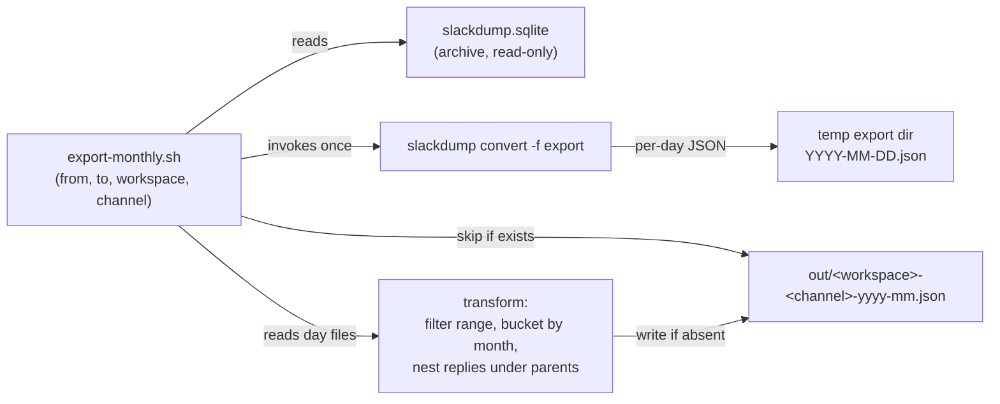

# DESIGN — Monthly JSON Exporter

Tracks: `SlackBackup-9iw`. Companion to `docs/DESIGN.md` (the backup system that produces the
archives this tool consumes). This document covers **export only** — turning the durable
`slackdump.sqlite` archives into bounded, per-month JSON suitable for downstream search/analysis.

> Scope note: CONTEXT.md currently lists conversion and search/analysis as Non-Goals of the
> *backup* project. This exporter is the first piece of that later, separate phase — it consumes
> the archive as input and never modifies it. If this capability is adopted, CONTEXT.md
> §Non-Goals and §Core Capabilities need a corresponding update (see Known Gaps).

---

## Solution Strategy

The backup system already commits one `slackdump.sqlite` per channel at
`<archive-root>/<workspace>/<channel-slug>/slackdump.sqlite` (see `docs/DESIGN.md` §State
Management). That database is the single source of truth — the exporter is a **read-only
consumer** of it and writes a separate output tree. It never calls the Slack API.

slackdump's own `convert` command already renders an archive to the **Slack Export** format —
a documented, version-stable structure of per-day JSON files (`YYYY-MM-DD.json`) carrying thread
metadata. Rather than couple to slackdump's *internal* SQLite schema (the `convert` help
explicitly describes that schema as internal and subject to change), the exporter reads through
that documented export boundary. This mirrors the project's existing lesson from the backup
side — lean on slackdump built-ins instead of reimplementing them (`resume` over a custom
incremental scheme).

The genuinely custom logic, which slackdump does not provide, is:

1. **Date-range bounding** — emit only messages whose timestamp falls in `[from, to]`.
2. **Monthly bucketing + naming** — one file per `(workspace, channel, year-month)`, named
   `workspace-channel-yyyy-mm.json`.
3. **Thread nesting** — replies nested *under* their parent message, not flat.
4. **Idempotent skip (sealed months only)** — if the target `workspace-channel-yyyy-mm.json`
   already exists, do not regenerate it — **except** the **trailing month** (the latest month
   that has any data in the archive), which is always rewritten because the archive may not yet
   hold all of that month's messages.

### Approach decision

| Strategy | Read boundary | Decision |
|----------|---------------|----------|
| **A — Read `slackdump.sqlite` directly** | Internal, version-volatile schema (`MESSAGE.DATA` blobs, `THREAD_TS`, `IS_PARENT`) | Rejected as primary. Tightest coupling; the schema is documented by slackdump as internal. |
| **B — `slackdump convert -f export` → transform** *(chosen)* | Documented Slack Export format (per-day JSON, stable) | Chosen. slackdump owns the fragile sqlite→message decoding; the exporter owns only bucketing, nesting, naming, idempotency. |

Strategy A remains a fallback if a future slackdump release drops or changes `convert -f export`.

---

## Runtime Architecture



---

## Building Block View

### Level 1 — System Overview

| Component | Responsibility |
|-----------|----------------|
| `scripts/export-monthly.sh` (entry point) | Parse args (`--from`, `--to`, `--workspace`, `--channel`, `--archive-root`, `--out`); locate the channel's `slackdump.sqlite`; orchestrate convert → transform → write. |
| `slackdump convert -f export` | Decode the SQLite archive into the documented Slack Export day-file layout in a temp dir. Owned by slackdump; not reimplemented. |
| Transform step | Read day files, drop out-of-range messages, group into month buckets keyed by the **parent** message's month, nest replies under their parent, emit one ordered JSON document per month. |
| Idempotency guard | Before writing `<workspace>-<channel>-yyyy-mm.json`, test for its existence; if present, skip without invoking the transform's write. |

### Entry-point contract (I4)

```
export-monthly.sh --from YYYY-MM-DD --to YYYY-MM-DD \
                  --workspace <ws> --channel <slug> \
                  --archive-root <path> --out <dir>

  Input  : <archive-root>/<ws>/<slug>/slackdump.sqlite        (must exist)
           <archive-root>/<ws>/<slug>/.last_backup            (optional seal stamp)
  Output : <out>/<ws>-<slug>-YYYY-MM.json  for each month overlapping [from,to]
  Signal : exit 0 = every in-range month present on disk (written or pre-existing)
           exit 2 = archive not found for (workspace, channel)
  Stdout : one line per month — "wrote" | "rewrote (trailing month)"
                                 | "rewrote (late reply to sealed month)"
                                 | "skipped (exists)" | "empty (no messages)"
```

---

## Data Model

### Input — Slack Export day file (from `slackdump convert`)

A `YYYY-MM-DD.json` file is a JSON **array** of Slack message objects for that calendar day.
Thread structure is *flat* in this format: a thread root and its replies all appear as
sibling array entries, related only by shared fields:

| Field | Meaning |
|-------|---------|
| `ts` | Message timestamp (`"1718990400.123456"`) — also the unique id and the sort key. |
| `thread_ts` | Present on a root **and** on each of its replies; equals the root's `ts`. Absent on non-threaded messages. |
| `reply_count`, `replies[]` | On the root only; slackdump's reply pointers. Not used for nesting — see below. |

### Output — `<workspace>-<channel>-yyyy-mm.json`

A single JSON document per month:

```jsonc
{
  "workspace": "f3pugetsound",
  "channel":   "helpdesk",
  "month":     "2026-06",
  "range":     { "from": "2026-06-01", "to": "2026-06-30" },
  "generated": "2026-06-22T18:00:00Z",
  "messages": [
    {
      "ts": "1718...",
      "user": "U123",
      "display_name": "Jane Doe",
      "text": "parent message",
      "files": [ { "name": "report.pdf", "filetype": "pdf", "permalink": "https://..." } ],
      "replies": [
        { "ts": "1718...", "user": "U456", "display_name": "John Smith", "text": "nested reply" }
      ]
    },
    { "ts": "1718...", "user": "U789", "display_name": "U789", "text": "standalone, no replies key" }
  ]
}
```

Field reduction: each message (parent or reply) is projected down to `ts`, `user`, `display_name`,
`text`, and `files` (only present when the raw message had files) — Slack-API plumbing
(`blocks`, `client_msg_id`, `team`, `user_profile`, `metadata`, `reply_count`, `reply_users`,
`replace_original`, etc.) is dropped, since it's noise for an LLM analyzing conversations,
threads, links, and references. `display_name` is resolved from the `users.json` that
`slackdump convert -f export` writes alongside the day files (`profile.display_name`, falling
back to `real_name`, then `name`, then the raw `user` id if the user isn't in the map at all) —
`user` (the id) is always kept too, so messages stay cross-referenceable by id even though the
display name is what a reader/LLM will normally cite. A `files` entry is reduced to `name`,
`filetype`, and `permalink` (no thumbnails, internal URLs, or other file metadata).

Nesting rules:

- A message with no `thread_ts`, or whose `thread_ts == ts` and has no replies, is a top-level
  entry with no `replies` key.
- A reply (`thread_ts != ts`) is **removed** from the top level and appended to its parent's
  `replies` array, ordered by `ts`. Nesting is structural only — no field rewriting or lossy
  conversion beyond the field reduction above, which applies identically to parents and replies.
- `messages` and every `replies` array are sorted ascending by `ts`.

### Bucketing rule (thread integrity)

A thread is assigned to **one** month — the month of its **parent** `ts` — even when replies
land in a later month. This keeps any single thread whole in one file rather than split across
two. Consequently a reply can appear in an *earlier* month file than its own timestamp; this is
intentional and documented here so consumers don't treat `replies[].ts` as bounded by the
file's month.

### Date-range rule

`[from, to]` bounds which **threads** are emitted, evaluated against the **parent** `ts`. A
thread whose parent falls in range carries all its replies regardless of their individual
timestamps (consistent with the bucketing rule). Months that the range only partially covers
still produce a file, containing just the in-range threads for that month.

---

## Crosscutting Concepts

### Idempotency

The unit of idempotency is the output **file**, with one exception: the **trailing month** is
always (re)written. The trailing month is the latest month that has any message in the archive
— *not* the wall-clock current month. It is computed from the archive's own high-water mark
(the max message `ts` across the converted day files), independent of the requested range.

A month is treated as **sealed** — safe to skip if its file exists — only when the archive
holds data in some *later* month. The existence of a later message proves the backup has
progressed past month M, so M can no longer gain messages. The trailing month has no later data
to seal it, so it is assumed potentially incomplete: this is the case where a backup is simply
overdue and more of that month's history may still arrive on the next backup run. Rewriting it
every export run keeps it correct without the operator having to reason about backup cadence.

For each **sealed** month, the tool still computes that month's messages (cheap — the single
per-run `convert` already paid the cost), then compares the result against the existing
`<out>/<workspace>-<channel>-yyyy-mm.json`; only if the content is unchanged is the write
skipped. This matters because **sealing is about new threads, not new replies**: a thread
parented in month M can receive a reply long after M is sealed and written (Slack threads don't
expire), and that reply must still land nested under its parent in M's file. Re-running with the
same or an overlapping range is a no-op for sealed months whose content truly hasn't changed, and
transparently reopens-and-rewrites a sealed month the moment a late reply to one of its threads
shows up — reported as `rewrote (late reply to sealed month)` rather than `skipped (exists)`. To
force regeneration of a sealed month for any other reason, delete its target file first.

#### Sealing signal — how we know a month is complete

"Sealed" needs a trustworthy predicate. Three are available, in increasing authority:

| # | Seal predicate for month M | Coupling / cost | Weakness |
|---|----------------------------|-----------------|----------|
| 1 | **Message high-water mark** — the archive holds a message in some month later than M. | None — uses only the converted day files. | A channel that has gone **quiet** never gets a later message, so its last active month is rewritten on every run forever and never stabilises. Harmless but wasteful, and that file is perpetually "provisional". |
| 2 | **Backup-completion stamp** *(recommended)* — a durable UTC timestamp the backup job writes after a successful `archive`/`resume`; M is sealed iff `last_backup > end_of_month(M)`. | One line in `scripts/backup.sh` to write a `<channel-dir>/.last_backup` sidecar. Git-durable (content, not mtime); no slackdump-internal coupling. | Requires the backup side to cooperate; archives written before the stamp existed have none. |
| 3 | **slackdump internal fetch timestamp** — the chunk-recording time slackdump stamps inside `slackdump.sqlite`. | Couples to slackdump's internal schema — the exact coupling Strategy B exists to avoid. | Rejected for the same reason Strategy A was. |

**Decision:** use **(2) when the stamp is present, falling back to (1) when it is absent.** This
correctly seals a quiet channel's last active month as soon as a backup runs after that month
ends — directly handling the "we just haven't backed up yet, more data may arrive" case the
high-water mark alone gets wrong — while degrading gracefully on pre-stamp archives. (3) is
rejected: the same wall-clock catch-up time is obtainable from a sidecar we control without
binding to slackdump internals.

Why mtime is **not** used as the stamp: a file's modification time is reset to checkout time by
`git clone`/`git checkout`, so in the git-backed archive repo it would falsely seal or unseal
months after any fresh clone. The stamp must be file *content*, not filesystem metadata.

### Read-only isolation

The exporter opens `slackdump.sqlite` only via `slackdump convert` (read path) and writes
exclusively under `--out`. It never touches the archive tree, so it can run concurrently with,
or independently of, the backup job without risking the data-loss footguns documented in
`docs/DESIGN.md` (the `archive`-over-existing and `-dedupe` bugs).

### Test plan

**Fixture-based** (a small committed `slackdump.sqlite` or pre-converted day files — no Slack
boundary needed, this tool has none):

1. **Nesting** — a 1-root/2-reply thread produces one top-level message with a 2-element
   `replies` array in `ts` order; no reply leaks to top level.
2. **Cross-month thread** — root in month M, reply in M+1 → entire thread in the M file; the
   M+1 file does not contain the reply as a top-level message.
3. **Range bounding** — `--from/--to` inside a single month emits only in-range threads.
4. **Monthly split** — an archive spanning 3 months yields exactly 3 correctly-named files.
5. **Idempotency** — second run over the same range writes nothing and reports `skipped` for
   every month; pre-existing file bytes are unchanged.
6. **Naming** — output filename is exactly `<workspace>-<channel>-yyyy-mm.json` for the
   `(workspace, channel)` from the archive path.

**Boundary** (real slackdump binary):

7. `slackdump convert -f export` on a real archive yields the day-file layout the transform
   assumes (guards against a slackdump version drift breaking the read boundary — the chosen
   coupling point).

---

## Known Gaps & Recommendations

| Gap | Assessment | Recommendation |
|-----|------------|----------------|
| Knowing a month is **complete** | **Resolved by design** — a month is sealed (skip-protected) only when proven complete by the seal predicate, otherwise always rewritten (see Crosscutting §Sealing signal). Preferred predicate is a backup-completion stamp; fallback is the message high-water mark. | Add a `<channel-dir>/.last_backup` UTC stamp write to `scripts/backup.sh` (filed as follow-up). Until then the high-water-mark fallback applies, which rewrites a quiet channel's last active month every run. |
| Backup side does not yet write the seal stamp | The recommended predicate (2) depends on `scripts/backup.sh` writing `.last_backup` after a successful run; it currently does not. | File an implementation issue against `scripts/backup.sh`; exporter must tolerate the stamp's absence and fall back to the high-water mark. |
| Skip rule ignores **range width** | A month file first written under a narrow `--from/--to` will be skipped under a later wider range, so it never gains the additional threads. | Document that idempotency keys on filename only; widening a range requires deleting affected month files. Acceptable for the intended "export once, immutable monthly snapshots" model. |
| Per-run `convert` cost | Each invocation converts the whole archive to temp before any per-month skip, so skipped months still pay the conversion. | Acceptable at current archive sizes. If archives grow large, revisit Strategy A (direct SQLite range query) to avoid full conversion. |
| CONTEXT.md Non-Goals | Export/conversion is presently a stated Non-Goal of the backup project. | Before implementing, update `docs/CONTEXT.md` §Non-Goals and §Core Capabilities, or formally scope this as a separate downstream project per the scope note above. |

---

## References

| Document | Location | Covers |
|----------|----------|--------|
| Backup system design | `docs/DESIGN.md` | Archive layout, `slackdump.sqlite` state, dedupe/archive footguns |
| slackdump convert | `slackdump help convert` | Export-format conversion from an archive |
| Slack export format | `slackdump help chunk`, Slack docs | Day-file layout and thread fields |
