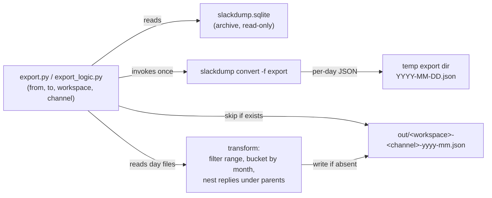

# DESIGN — Export Pipeline (`./slackbackup export ...`)

Companion to `docs/DESIGN.md` (the backup system that produces the archives this tool consumes).
This document covers **export only** — three read-only, derived products built from the durable
`slackdump.sqlite` archives (plus the catalog cache for two of them). None of the three ever
modifies the archive or makes a Slack API call; all three are implemented in
`src/slackbackup/export_logic.py`, wired to the CLI in `export.py`:

| Command | Covers below | Scope |
|---------|---------------|-------|
| `export monthly` | §Monthly Export | One channel, bounded date range, sealed/idempotent per-month files |
| `export digest` | §Digest Export | Many workspaces, trailing 180 days by default (or a different N), one merged chronological document |
| `export users` | §User Profiles Export | Full per-workspace user roster, not just digest posters |

A digest run driven by a report job (`--jobs`) can additionally emit two companion documents
alongside its digest: a user roster (`users_out`) and the **`files_out` sidecar** that, since
schema v4, carries the extracted file/Canvas text the digest itself no longer embeds.

---

## Monthly Export (`export monthly`)

### Solution Strategy

The backup system already commits one `slackdump.sqlite` per channel at
`<archive-root>/<workspace>/<channel-slug>/slackdump.sqlite` (see `docs/DESIGN.md` §Building
Block View, Level 2 — Local storage). That database is the single source of truth — the exporter
is a **read-only consumer** of it and writes a separate output tree. It never calls the Slack API.

slackdump's own `convert` command already renders an archive to the **Slack Export** format —
a documented, version-stable structure of per-day JSON files (`YYYY-MM-DD.json`) carrying thread
metadata. Rather than couple to slackdump's *internal* SQLite schema (the `convert` help
explicitly describes that schema as internal and subject to change), the exporter reads through
that documented export boundary. This mirrors the project's existing lesson from the backup
side — lean on slackdump built-ins instead of reimplementing them (`resume` over a custom
incremental scheme).

The genuinely custom logic, which slackdump does not provide, is:

1. **Date-range bounding** — emit only messages whose timestamp falls in `[from, to]`.
2. **Monthly bucketing + naming** — one file per `(workspace, channel, year-month)`, named
   `workspace-channel-yyyy-mm.json`.
3. **Thread nesting** — replies nested *under* their parent message, not flat.
4. **Idempotent skip (sealed months only)** — if the target `workspace-channel-yyyy-mm.json`
   already exists, do not regenerate it — **except** the **trailing month** (the latest month
   that has any data in the archive), which is always rewritten because the archive may not yet
   hold all of that month's messages.

#### Approach decision

| Strategy | Read boundary | Decision |
|----------|---------------|----------|
| **A — Read `slackdump.sqlite` directly** | Internal, version-volatile schema (`MESSAGE.DATA` blobs, `THREAD_TS`, `IS_PARENT`) | Rejected as primary. Tightest coupling; the schema is documented by slackdump as internal. |
| **B — `slackdump convert -f export` → transform** *(chosen)* | Documented Slack Export format (per-day JSON, stable) | Chosen. slackdump owns the fragile sqlite→message decoding; the exporter owns only bucketing, nesting, naming, idempotency. |

Strategy A remains a fallback if a future slackdump release drops or changes `convert -f export`.

---

### Runtime Architecture


```mermaid
graph LR
    CLI["export.py / export_logic.py<br/>(from, to, workspace, channel)"] -->|reads| DB["slackdump.sqlite<br/>(archive, read-only)"]
    CLI -->|invokes once| CV["slackdump convert -f export"]
    CV -->|per-day JSON| TMP["temp export dir<br/>YYYY-MM-DD.json"]
    CLI -->|reads day files| TR["transform:<br/>filter range, bucket by month,<br/>nest replies under parents"]
    CLI -->|skip if exists| OUT["out/&lt;workspace&gt;-&lt;channel&gt;-yyyy-mm.json"]
    TR -->|write if absent| OUT
```

---

### Building Block View

#### Level 1 — System Overview

| Component | Responsibility |
|-----------|----------------|
| `export.py` (CLI) + `export_logic.build_digest`'s sibling `export_month`/`export_transform` (logic) | Parse args (`--from`, `--to`, `--workspace`, `--channel`, `--archive-root`, `--out`); locate the channel's `slackdump.sqlite`; orchestrate convert → transform → write. |
| `slackdump convert -f export` | Decode the SQLite archive into the documented Slack Export day-file layout in a temp dir. Owned by slackdump; not reimplemented. |
| Transform step | Read day files, drop out-of-range messages, group into month buckets keyed by the **parent** message's month, nest replies under their parent, emit one ordered JSON document per month. |
| Idempotency guard | Before writing `<workspace>-<channel>-yyyy-mm.json`, test for its existence; if present, skip without invoking the transform's write. |

#### Entry-point contract (I4)

```
./slackbackup export monthly --from YYYY-MM-DD --to YYYY-MM-DD \
                  --workspace <ws> --channel <slug> \
                  --archive-root <path> --out <dir>

  Input  : <archive-root>/<ws>/<slug>/slackdump.sqlite        (must exist)
           <archive-root>/<ws>/<slug>/.last_backup            (optional seal stamp)
  Output : <out>/<ws>-<slug>-YYYY-MM.json  for each month overlapping [from,to]
  Signal : exit 0 = every in-range month present on disk (written or pre-existing)
           exit 2 = archive not found for (workspace, channel)
  Stdout : one line per month — "wrote" | "rewrote (trailing month)"
                                 | "rewrote (late reply to sealed month)"
                                 | "skipped (exists)" | "empty (no messages)"
```

---

### Data Model

#### Input — Slack Export day file (from `slackdump convert`)

A `YYYY-MM-DD.json` file is a JSON **array** of Slack message objects for that calendar day.
Thread structure is *flat* in this format: a thread root and its replies all appear as
sibling array entries, related only by shared fields:

| Field | Meaning |
|-------|---------|
| `ts` | Message timestamp (`"1718990400.123456"`) — also the unique id and the sort key. |
| `thread_ts` | Present on a root **and** on each of its replies; equals the root's `ts`. Absent on non-threaded messages. |
| `reply_count`, `replies[]` | On the root only; slackdump's reply pointers. Not used for nesting — see below. |

#### Output — `<workspace>-<channel>-yyyy-mm.json`

A single JSON document per month:

```jsonc
{
  "workspace": "f3pugetsound",
  "channel":   "helpdesk",
  "month":     "2026-06",
  "range":     { "from": "2026-06-01", "to": "2026-06-30" },
  "generated": "2026-06-22T18:00:00Z",
  "messages": [
    {
      "ts": "1718...",
      "user": "U123",
      "display_name": "Jane Doe",
      "text": "parent message",
      "files": [ { "name": "report.pdf", "filetype": "pdf", "permalink": "https://..." } ],
      "replies": [
        { "ts": "1718...", "user": "U456", "display_name": "John Smith", "text": "nested reply" }
      ]
    },
    { "ts": "1718...", "user": "U789", "display_name": "U789", "text": "standalone, no replies key" }
  ]
}
```

Field reduction: each message (parent or reply) is projected down to `ts`, `user`, `display_name`,
`text`, and `files` (only present when the raw message had files) — Slack-API plumbing
(`blocks`, `client_msg_id`, `team`, `user_profile`, `metadata`, `reply_count`, `reply_users`,
`replace_original`, etc.) is dropped, since it's noise for an LLM analyzing conversations,
threads, links, and references. `display_name` is resolved from the `users.json` that
`slackdump convert -f export` writes alongside the day files (`profile.display_name`, falling
back to `real_name`, then `name`, then the raw `user` id if the user isn't in the map at all) —
`user` (the id) is always kept too, so messages stay cross-referenceable by id even though the
display name is what a reader/LLM will normally cite. A `files` entry is reduced to `name`,
`filetype`, and `permalink` (no thumbnails, internal URLs, or other file metadata).

Nesting rules:

- A message with no `thread_ts`, or whose `thread_ts == ts` and has no replies, is a top-level
  entry with no `replies` key.
- A reply (`thread_ts != ts`) is **removed** from the top level and appended to its parent's
  `replies` array, ordered by `ts`. Nesting is structural only — no field rewriting or lossy
  conversion beyond the field reduction above, which applies identically to parents and replies.
- `messages` and every `replies` array are sorted ascending by `ts`.

#### Bucketing rule (thread integrity)

A thread is assigned to **one** month — the month of its **parent** `ts` — even when replies
land in a later month. This keeps any single thread whole in one file rather than split across
two. Consequently a reply can appear in an *earlier* month file than its own timestamp; this is
intentional and documented here so consumers don't treat `replies[].ts` as bounded by the
file's month.

#### Date-range rule

`[from, to]` bounds which **threads** are emitted, evaluated against the **parent** `ts`. A
thread whose parent falls in range carries all its replies regardless of their individual
timestamps (consistent with the bucketing rule). Months that the range only partially covers
still produce a file, containing just the in-range threads for that month.

---

### Crosscutting Concepts

#### Idempotency

The unit of idempotency is the output **file**, with one exception: the **trailing month** is
always (re)written. The trailing month is the latest month that has any message in the archive
— *not* the wall-clock current month. It is computed from the archive's own high-water mark
(the max message `ts` across the converted day files), independent of the requested range.

A month is treated as **sealed** — safe to skip if its file exists — only when the archive
holds data in some *later* month. The existence of a later message proves the backup has
progressed past month M, so M can no longer gain messages. The trailing month has no later data
to seal it, so it is assumed potentially incomplete: this is the case where a backup is simply
overdue and more of that month's history may still arrive on the next backup run. Rewriting it
every export run keeps it correct without the operator having to reason about backup cadence.

For each **sealed** month, the tool still computes that month's messages (cheap — the single
per-run `convert` already paid the cost), then compares the result against the existing
`<out>/<workspace>-<channel>-yyyy-mm.json`; only if the content is unchanged is the write
skipped. This matters because **sealing is about new threads, not new replies**: a thread
parented in month M can receive a reply long after M is sealed and written (Slack threads don't
expire), and that reply must still land nested under its parent in M's file. Re-running with the
same or an overlapping range is a no-op for sealed months whose content truly hasn't changed, and
transparently reopens-and-rewrites a sealed month the moment a late reply to one of its threads
shows up — reported as `rewrote (late reply to sealed month)` rather than `skipped (exists)`. To
force regeneration of a sealed month for any other reason, delete its target file first.

#### Sealing signal — how we know a month is complete

"Sealed" needs a trustworthy predicate. Three are available, in increasing authority:

| # | Seal predicate for month M | Coupling / cost | Weakness |
|---|----------------------------|-----------------|----------|
| 1 | **Message high-water mark** — the archive holds a message in some month later than M. | None — uses only the converted day files. | A channel that has gone **quiet** never gets a later message, so its last active month is rewritten on every run forever and never stabilises. Harmless but wasteful, and that file is perpetually "provisional". |
| 2 | **Backup-completion stamp** *(implemented)* — a durable UTC timestamp the backup job writes after a successful `archive`/`resume`; M is sealed iff `last_backup > end_of_month(M)`. | `backup_logic._write_last_backup()` writes a `<channel-dir>/.last_backup` sidecar after each successful archive/resume. Git-durable (content, not mtime); no slackdump-internal coupling. | Archives written before the stamp existed have none (exporter falls back to (1) for those). |
| 3 | **slackdump internal fetch timestamp** — the chunk-recording time slackdump stamps inside `slackdump.sqlite`. | Couples to slackdump's internal schema — the exact coupling Strategy B exists to avoid. | Rejected for the same reason Strategy A was. |

**Decision:** use **(2) when the stamp is present, falling back to (1) when it is absent.** This
correctly seals a quiet channel's last active month as soon as a backup runs after that month
ends — directly handling the "we just haven't backed up yet, more data may arrive" case the
high-water mark alone gets wrong — while degrading gracefully on pre-stamp archives. (3) is
rejected: the same wall-clock catch-up time is obtainable from a sidecar we control without
binding to slackdump internals.

Why mtime is **not** used as the stamp: a file's modification time is reset to checkout time by
`git clone`/`git checkout`, so in the git-backed archive repo it would falsely seal or unseal
months after any fresh clone. The stamp must be file *content*, not filesystem metadata.

#### Read-only isolation

The exporter opens `slackdump.sqlite` only via `slackdump convert` (read path) and writes
exclusively under `--out`. It never touches the archive tree, so it can run concurrently with,
or independently of, the backup job without risking the data-loss footguns documented in
`docs/DESIGN.md` (the `archive`-over-existing and `-dedupe` bugs).

#### Test plan

**Fixture-based** (a small committed `slackdump.sqlite` or pre-converted day files — no Slack
boundary needed, this tool has none):

1. **Nesting** — a 1-root/2-reply thread produces one top-level message with a 2-element
   `replies` array in `ts` order; no reply leaks to top level.
2. **Cross-month thread** — root in month M, reply in M+1 → entire thread in the M file; the
   M+1 file does not contain the reply as a top-level message.
3. **Range bounding** — `--from/--to` inside a single month emits only in-range threads.
4. **Monthly split** — an archive spanning 3 months yields exactly 3 correctly-named files.
5. **Idempotency** — second run over the same range writes nothing and reports `skipped` for
   every month; pre-existing file bytes are unchanged.
6. **Naming** — output filename is exactly `<workspace>-<channel>-yyyy-mm.json` for the
   `(workspace, channel)` from the archive path.

**Boundary** (real slackdump binary):

7. `slackdump convert -f export` on a real archive yields the day-file layout the transform
   assumes (guards against a slackdump version drift breaking the read boundary — the chosen
   coupling point).

---

## Digest Export (`export digest`)

A single merged document covering the trailing 180 days by default (or a different N via
`--days`, or every message ever archived if a job sets `"days": null`) across every workspace
matching a glob or comma-separated selector list, intended as
direct LLM input (e.g. for a newsletter-generation prompt) — unlike `export monthly`'s many
small per-channel-month files, this is one document, one read.

```
./slackbackup export digest --archive-root <path> --channels-file ./channels.json \
    --workspace f3* [--days N] [--as-of YYYY-MM-DD] --out <file.json>
```

`--days` defaults to 180 (the trailing 180 days ending at `--as-of`). Pass `--days N` to scope it
to a different trailing window, or set a job's own `"days": null` to span everything ever archived
instead.

Best-effort across channels: a channel with no local archive is recorded with
`status: "missing_archive"` in the `channels` array rather than aborting the run — one
un-archived channel in a 100-channel workspace glob must not block the whole digest.

### Channel context — catalog, not a live call

Each channel's entry under `channels` is enriched with
`description`/`topic`/`purpose`/`creator`/`created_at`, read **read-only from the already-cached
catalog** (`catalog_logic.load`, never `refresh_*`) — the digest stays purely local and never
triggers a Slack API call of its own; if the cache was never warmed for a channel (e.g. a fresh
checkout with no `~/.cache/slackbackup/`), those fields are simply `null` rather than blocking on
a live fetch.

`description` is `catalog_logic.description_of()`'s merge — topic if set, else purpose, so it can
silently drop one or the other. `topic` and `purpose` are the raw Slack values kept alongside it
(additive, sat-hkd) so a query over the digest can use either signal independently — e.g. a
channel whose topic is logistical ("read the pinned FAQ") but whose purpose states its actual
charter (a site-Q channel, a leadership channel's remit).

### Files & Canvases (all types, including images) — read from the archive's own `FILE` table, not `convert`

`slackdump convert -f export` never surfaces a channel-level Canvas at all: a Canvas isn't a
reply to any message (`FILE.MESSAGE_ID` is empty for it, per the table's own comment), so it has
no anchor in the message-export day files. `_load_channel_files` instead reads
`slackdump.sqlite`'s `FILE` table directly — every file, images included — and resolves
`local_path` (relative to the archive root) whenever the blob was actually downloaded by
`slackdump archive`/`resume` (default `-files=true`; see `docs/references/slackdump-cli-notes.md`).

Content extraction (`_extract_file_content`) additionally populates a `content` field, so an LLM
can read the file's substance and not just its name, for the types cheap to read without a heavy
dependency:

| Mimetype | Method |
|---|---|
| `application/vnd.slack-docs` (Canvas), `text/html` | stdlib `HTMLParser`, block/table-aware text extraction |
| `text/*` | read verbatim |
| `application/pdf` | `pypdf` page text extraction (a declared project dependency) |
| `.docx`/`.pptx`/`.xlsx` (OOXML) | these are just zip archives of XML — stdlib `zipfile` + a regex over `<w:t>`/`<a:t>` text runs (docx/pptx) or `sharedStrings.xml` (xlsx); no new dependency |

Everything else — images, video, audio, external links with no downloaded blob — stays
metadata-only (`content: null`) but still carries `local_path` when the blob exists, so a reader
or downstream tool can open it directly even without extracted text. A survey of live archives
(2026-07-24, 483 channel databases) found the PDF/docx/pptx/xlsx corpus small (46 files, ~31 MB)
and images/video dominant by volume (5,539 images/12.3 GB, 243 videos/6.8 GB) — extraction was
scoped to the former; the latter get no OCR/transcription (out of scope, would need a vision/audio
model, not a parser).

`_load_channel_files` also stamps three change-detection fields onto every entry (sat-811 §8),
none of which appear in the digest itself — they exist for the `files_out` sidecar below:
`content_sha256` (sha256 of extracted `content`, `null` when there's no content), `blob_captured_at`
(the blob's on-disk mtime — capture/refresh time, **not** an edit time), and `archive_status`
(`content_extracted` / `no_blob` / `unsupported_type` / `tombstone`, the last from Slack's own
`mode: "tombstone"` on a deleted file's `FILE` row).

#### `files_out` sidecar and the digest's `content` removal (schema v4)

Measured against a real digest (2026-08, f3-nation, 52 channels/1 workspace/1 month): `channels[]`
was 5.74 MB of an 8.44 MB document, and `files[].content` alone was 4.61 MB of that — 55% of the
whole file, duplicated verbatim into **every** monthly file since a file has no natural month (see
§Monthly digest splitting). For `f3-pugetsound` (383 channels/7 workspaces), this made
`channels_meta` the single largest resident structure in `export digest`'s process and a
contributing cause of an OOM kill (sat-811).

v4's fix: `channels[].files[]` in the digest keeps every v3 field **except** `content` (and the
three change-detection fields above), and gains `has_content: true|false`. The extracted text
itself moves to a companion **`files_out`** sidecar document (`schema_version:
"slack-llm-files-v1"`), written per job alongside the digest (see §Report jobs). Join key is
`(workspace, channel_id, id)`.

The sidecar is written **only on the `--jobs` path**, and only for a job that sets `files_out` —
there is no `--files-out` command-line flag. A plain `export digest` run still extracts file
content (the digest's `has_content` depends on it) but simply discards it when the process exits.
A job that wants the text must declare `files_out`.

```jsonc
{
  "schema_version": "slack-llm-files-v1",
  "generated_at": "2026-08-06T09:00:00Z",
  "files": [
    { "workspace": "f3pugetsound", "channel": "ao-active-book-club", "channel_id": "C...",
      "id": "F05KESM0B7C", "name": "Upcoming_Q_Schedule", "title": "Upcoming Q Schedule",
      "filetype": "quip", "mimetype": "application/vnd.slack-docs", "pretty_type": "Canvas",
      "creator": "U...", "created_at": "2023-07-30T22:40:54Z", "size": 2776,
      "permalink": "https://...", "local_path": "f3pugetsound/.../__uploads/F.../Upcoming_Q_Schedule",
      "content": "Q | Date | AO\n...", "content_sha256": "a1b2...", "archive_status": "content_extracted",
      "blob_captured_at": "2026-08-05T09:12:00Z",
      "first_seen_at": "2026-03-01T09:00:00Z", "content_changed_at": "2026-07-26T09:00:00Z",
      "modification_history": [
        { "at": "2026-07-05T14:03:00Z", "editor_name": "Daniel Hüsch", "editor_user_id": "U...",
          "editor_match_confidence": "high", "channel": "ao-active-book-club", "channel_id": "C...",
          "message_ts": "1783...53" }
      ],
      "modification_history_completeness": "partial", "last_modified_at": "2026-07-26T09:00:00Z" }
  ]
}
```

Unlike the digest, `files_out` is **cumulative across runs, not `days`-window-relative** — the
same as `_load_channel_files` itself, which already reads the whole archive's `FILE` table every
run regardless of `--days`. Each run merges its freshly-read entries into whatever `files_out`
already sits at that path (`export_logic.merge_files_out`), keyed by `(workspace, channel_id,
id)`:

- `first_seen_at` is stamped once, on the run a file id first appears, and carried forward
  unchanged after that.
- `content_changed_at` is re-stamped with the current run's timestamp only when `content_sha256`
  actually differs from the previous snapshot; otherwise it carries forward whatever it already
  was (`null` if never observed to change).
- `last_modified_at`, present only when `modification_history` is non-empty, is the max of that
  history's `at` values.

The merge is **additive, not a rebuild from this run's scan alone**: a file recorded in a prior
run's `files_out` but absent from this run's freshly-read entries — its channel fell outside a
`--workspace`/`--channel` selector, its 90-day Slack retention window expired, or its archive is
transiently missing — is carried forward into the merged sidecar unchanged rather than dropped.
Slack's own retention already destroys the source; `files_out` must not additionally destroy its
own record of a file it saw while that file still existed on Slack.

##### Canvas edit history from `tabbed_canvas_updated` (sat-811 §9 / sat-2s9)

Slack posts a `tabbed_canvas_updated` system message into a channel whenever a Canvas tab is
edited (`user: "USLACKBOT"`, no `text`; the real editor's display name and the canvas's `file_id`
are only recoverable from the message's Block Kit payload). `_extract_canvas_modification_events`
parses these (defensively — the block shape is reverse-engineered from the archive, not Slack
documentation) into per-file edit events, which land in that file's `modification_history` in the
sidecar above. The notices themselves are then **stripped from `messages[]`** before range
filtering/counting — left in, they inflated `root_message_count`/`participant_count` for the
`USLACKBOT` account (a real counting bug fixed by this same change; see the digest manifest's
`has_content` entry for the visible note).

Editor-name → user-id resolution (`_resolve_canvas_editor`) matches the notice's raw display
string against the workspace roster's normalized `real_name`, and only ever emits
`editor_user_id`/`editor_match_confidence` for an unambiguous single match — a compound editor
("Daniel Hüsch and Justin Kinney") is detected (so it isn't mistaken for one person) but never
guessed at; `editor_name` (the raw string) is always emitted regardless.

**This signal is positively authoritative, negatively meaningless**: presence of an event proves
an edit happened at that time by that person; absence proves nothing, because these notices are
sometimes manually deleted from the channel by members who find them cluttering (confirmed by the
archive owner). Every canvas's sidecar entry therefore carries `modification_history_completeness:
"partial"` unconditionally — never read a canvas with no history, or an old one, as evidence it's
unmaintained. `content_sha256`/`content_changed_at` are the independent cross-check that survives
a deleted notice (derived from bytes on disk, not a channel message), and neither signal replaces
the other. Currency ranking, best to worst: `modification_history[].at` (via `last_modified_at`) >
`content_changed_at` > a file's own `shared_message_ts`/reshare evidence (not yet captured) >
`created_at`.

This directly narrows sat-2s9 ("canvas edits after first capture are invisible"): a canvas's
*blob* is in fact refreshed by `slackdump resume` on every backup cycle (its `FILE` metadata row
is not, and never carries a real `updated` field) — so canvas content was never as stale as that
issue originally assumed, and it is now independently detectable via `content_changed_at` and,
when the notice survives, `modification_history`. Forcing a proactive re-fetch or checking the
Slack API's own `updated` field (sat-2s9's other options) remain open, separate follow-ups if
still wanted.

Cross-referencing a post to a file it mentions needs no extra index: Slack embeds the literal
permalink in a message's raw text (e.g. `<https://f3pugetsound.slack.com/docs/T.../F...|Q
Schedule>`), the same URL the file's own `permalink` field carries — an LLM can match the two
directly from the digest's existing `text` and `permalink` fields.

### Leadership inference vs. authoritative `slack_roles`

Two distinct, deliberately separate signals appear in the digest:

- `leadership` (top-level) — **inferred** from display-name and profile-`title` patterns this
  F3 community uses to self-report a role (e.g. `"Jane Doe - Kirkland Region Nantan"`),
  pattern-matched against a curated title list and grouped `by_region`. This is a heuristic over
  free text, not a Slack-platform fact — a display name can be wrong, stale, or just not contain
  a title at all.
- `slack_roles` (per-user, on every cleaned user object — see §User Profiles Export below) —
  **authoritative**, read directly off the raw Slack user object's own `is_owner`/`is_admin`/
  `is_bot`/etc. flags. Unrelated to leadership inference; a workspace `admin` and an F3 `Nantan`
  are two different kinds of "role" that happen to both live on the same person.

No top-level merged "users"/"authors" table exists in the digest by design — the same Slack
`user` id (and even the same `display_name`) in two different workspaces is **not** the same
identity, each workspace has its own user namespace, so author info stays embedded per-message,
scoped to that message's own workspace.

#### Pluggable leadership handlers (`handlers/`)

All F3-specific role logic (title/display-name regexes, AO-vs-region scoping, tenure modifiers,
`derive_leadership`, `_build_leadership_by_region`) lives in `src/slackbackup/handlers/f3.py`,
**not** in `export_logic.py` — the export engine stays general-purpose and delegates the whole
`leadership` section to a handler. A handler is a module implementing two functions:

- `annotate_profile(display_name, title) -> dict | None` — per-profile tagging, called once per
  user in `build_user_profiles()`; the result is stashed on the profile as `derived_leadership`.
- `build_leadership(profiles_doc) -> dict` — aggregates the tagged profiles into the digest's
  top-level `leadership` section (`profile_role_matches`, `by_region`, `former_by_region`),
  called once per `build_digest()`.

`handlers/__init__.py` is a small registry (`handlers.get(name)`, `handlers.NAMES`); add a
non-F3 region/workspace by dropping in a sibling module and registering it, without touching the
export engine. Handler selection:

- `build_user_profiles(..., handler=None)` and `build_digest(..., handler=None)` default to **no
  handler** (empty leadership structure) — the general-purpose library default.
- `export digest --leadership-handler <name>` defaults to `f3` for a plain (non-`--jobs`) run,
  preserving this project's historically F3-only documented workflow.
- Report jobs (below) default their `leadership_handler` to `none` (opt-in per job), since a job
  may target a non-F3 workspace where F3 regexes would just produce noise.

### Output shape

`schema_version: "slack-llm-digest-v4"`. v2 evolved v1 **additively** — every v1 field/shape
still held; v2 only added fields (see `docs/adr/0001-digest-v2-additive-evidence.md` for that
decision). v3 makes three changes:

- **Condensation** — drops the redundant `posted_at_utc` field (UTC is always derivable from
  `posted_at_local`'s offset or from `ts`) and serializes the digest file compactly
  (`json.dumps(..., separators=(",", ":"))` instead of `indent=2`) — see
  `docs/adr/0002-digest-v3-condensation.md`. `message_url` is deliberately retained even though
  it too is derivable from `workspace`/`channel_id`/`ts`, because the downstream LLM must never
  construct a `p<ts>` permalink itself (ADR-0001).
- **Cross-workspace mention index** — a top-level `mentions` key, an inverted index keyed by
  canonical F3 name storing only message `ts` grouped workspace → channel, with accounts unified
  on deterministic evidence only (email hash; normalized F3 name plus real-name/username
  support) and conflicts flagged `ambiguous`, never merged — see
  `docs/adr/0003-mentions-index-deterministic-identity.md` and §Mentions index below.
- **Block Kit mention extraction** — per-message `mentions`/`links` extraction reads
  `blocks[].text.text` in addition to the top-level `text`, so bot-posted backblasts (whose
  *PAX*: line lives in a section block while `text` is a narrative-only fallback) no longer lose
  their PAX list (SlackBackup-rie).

v4 (sat-811, `docs/adr/0004-digest-v4-files-sidecar.md`) makes one further change: each channel file's extracted `content` moves out of this
document into a companion `files_out` sidecar, replaced by `has_content: true|false` — see
§`files_out` sidecar above for why and its schema. `tabbed_canvas_updated` system messages
(Slack's Canvas-edit notices) are also stripped from `messages[]` in v4, fixing a real counting
bug where they inflated `root_message_count`/`participant_count` for the `USLACKBOT` account; the
edit events they carried now live in the sidecar's per-file `modification_history` instead.

```jsonc
{
  "schema_version": "slack-llm-digest-v4",
  "generated_at": "2026-06-23T18:00:00Z",
  "export_scope": { "from": "2026-04-01", "to": "2026-06-23", "days": 180, "workspace_glob": "f3*" },
  "manifest": {
    "workspaces_included": 7,
    "counting_rules": {
      "has_content": "v4: a channel file's extracted text moved to a companion files_out sidecar (same job, same as_of) - join on (workspace, channel_id, id); has_content: false means no text was ever extractable, not that the sidecar is missing.",
      "root_message_count": "top-level messages only",
      "reply_count": "nested replies under root messages",
      "total_message_count": "root_message_count plus reply_count",
      "activity_status": "active when total_message_count > 0 in export_scope, else inactive",
      "in_scope": "false only on a parent that predates export_scope but whose thread was pulled in by an in-range reply (see §Cross-period thread inclusion below); absent/omitted means in scope. Never emitted as true.",
      "seq": "per-channel (not global) monotonic integer, 1..N, over every emitted record (root + nested replies) ascending by true post ts; lets a consumer flatten thread nesting back into true chronological order.",
      "mentions": "<@U...> user ids parsed from a message's text, first-appearance order, deduped; omitted when none.",
      "links": "Slack angle-bracket link tokens (<url>/<url|label>) parsed from a message's text, omitted when none; type is slack_message/slack_file/external.",
      "user_index": "top-level {workspace: {user_id: {display_name, is_bot}}}, scoped to ids referenced in that workspace's digest slice, never merged across workspaces.",
      "mentions_index": "top-level mentions key: inverted per-PAX mention index keyed by canonical F3 name; ts-only locations grouped workspace -> channel; deterministic identity unification with confidence flags (see §Mentions index)."
    },
    "known_limitations": [
      "Private or inaccessible channels may be absent",
      "User profile completeness depends on Slack profile data",
      "Leadership roles may be inferred from display names unless explicitly confirmed"
    ]
  },
  "channels": [
    { "workspace": "f3pugetsound", "channel": "ao-active-book-club", "channel_id": "C...",
      "status": "ok", "channel_url": "https://f3pugetsound.slack.com/archives/C...",
      "description": "...", "topic": "...", "purpose": "...", "creator": "U...", "created_at": "2024-01-01T00:00:00Z",
      "files": [ { "id": "F...", "name": "Upcoming_Q_Schedule", "title": "Upcoming Q Schedule",
                   "filetype": "canvas", "mimetype": "application/vnd.slack-docs", "pretty_type": "Canvas",
                   "creator": "U...", "created_at": "2026-01-05T00:00:00Z", "size": 4096,
                   "permalink": "https://...", "message_ts": "1718...", "local_path": "f3pugetsound/ao-active-book-club/__uploads/F.../Upcoming_Q_Schedule",
                   "has_content": true } ],
      "root_message_count": 12, "reply_count": 28, "total_message_count": 40, "participant_count": 8,
      "first_message_utc": "2026-04-01T12:00:00Z", "last_message_utc": "2026-06-20T08:00:00Z",
      "activity_status": "active", "activity_status_basis": "has messages during export_scope" },
    { "workspace": "f3kirkland", "channel": "general", "status": "missing_archive",
      "channel_url": "https://f3kirkland.slack.com/archives/C...", "files": [] }
  ],
  "workspace_activity_index": [
    { "workspace": "f3pugetsound", "channel_count": 232, "active_channel_count": 67, "inactive_channel_count": 165,
      "root_message_count": 1175, "reply_count": 755, "total_message_count": 1930, "participant_count": 118,
      "most_active_channel": { "channel": "tgt", "root_message_count": 400, "reply_count": 110, "total_message_count": 510 },
      "most_active_human_channel": { "channel": "ao-example", "root_message_count": 100, "reply_count": 80, "total_message_count": 180 },
      "inactive_channels": [ "m-distress-support", "otb" ],
      "inactive_definition": "zero root messages and zero nested replies during export_scope" }
  ],
  "messages": [
    { "ts": "1718...", "user": "U123", "display_name": "Jane Doe", "text": "...text <@U456> check <https://example.com|this>",
      "files": [ { "id": "F...", "name": "photo.jpg", "filetype": "jpg", "permalink": "https://...",
                   "local_path": "f3pugetsound/ao-active-book-club/__uploads/F.../photo.jpg" } ],
      "reactions": [ { "name": "+1", "count": 2, "users": ["U456", "U789"] } ],
      "edited": { "user": "U123", "at_utc": "2026-06-21T08:05:00Z" },
      "subtype": "channel_join",
      "unfurls": [ { "url": "https://...", "author_name": "...", "quoted_text": "...", "target_channel_id": "C...", "target_ts": "1718..." } ],
      "mentions": [ "U456" ],
      "links": [ { "url": "https://example.com", "label": "this", "type": "external" } ],
      "workspace": "f3pugetsound", "channel": "helpdesk", "channel_id": "C...",
      "message_url": "https://f3pugetsound.slack.com/archives/C.../p1718...",
      "posted_at_local": "2026-06-21T01:00:00-07:00",
      "seq": 42,
      "reply_count": 2, "thread_participant_count": 2, "thread_last_reply_utc": "2026-06-21T09:00:00Z",
      "replies": [
        { "ts": "1718...", "user": "U456", "display_name": "John Smith", "text": "reply text",
          "workspace": "f3pugetsound", "channel": "helpdesk", "channel_id": "C...",
          "message_url": "https://f3pugetsound.slack.com/archives/C.../p1718...",
          "posted_at_local": "2026-06-21T02:00:00-07:00",
          "thread_ts": "1718...", "seq": 43 }
      ] },
    { "ts": "1717...", "user": "U999", "display_name": "Old Poster", "text": "old thread parent, only here because a reply landed in scope",
      "workspace": "f3pugetsound", "channel": "helpdesk", "channel_id": "C...",
      "message_url": "https://f3pugetsound.slack.com/archives/C.../p1717...",
      "posted_at_local": "2026-03-15T01:00:00-07:00",
      "in_scope": false, "seq": 1,
      "reply_count": 1, "replies": [ "..." ] }
  ],
  "user_index": {
    "f3pugetsound": { "U123": { "display_name": "Jane Doe", "is_bot": false } }
  },
  "mentions": {
    "Bus Boy": {
      "aliases": [ "Bus Boy" ],
      "accounts": [ [ "f3kirkland", "U0BD3GFUUTZ" ] ],
      "match_confidence": "high",
      "workspaces": {
        "f3kirkland": {
          "channels": {
            "C0A6DGHR7D3": { "name": "ao-heritage-park", "message_ts": [ "1783887179.871339" ] }
          }
        }
      }
    }
  },
  "leadership": { "profile_role_matches": [ ... ], "by_region": [ ... ] },
  "consistency": {
    "channel_id_duplicate_count": 0, "file_reference_count": 1, "file_has_content_true_count": 1,
    "file_has_content_false_count": 0, "file_message_ts_present_count": 1, "file_message_ts_matched_count": 1,
    "file_message_ts_unmatched_count": 0, "mention_unresolved_count": 0, "in_scope_false_orphan_count": 0,
    "notes": { "scope": "...", "file_message_ts_unmatched_count": "...", "mention_unresolved_count": "...",
               "in_scope_false_orphan_count": "..." }
  }
}
```

`messages` is sorted chronologically across **all** workspaces — a digest reads as one merged
timeline, not grouped by workspace. `reply_count`/`thread_participant_count`/`thread_last_reply_utc`
appear only on a root message that has replies — they're rollups over the existing `replies[]`,
not a separate thread structure, so thread context stays in one place rather than duplicated
across a parallel index. `reactions`/`edited`/`subtype`/`unfurls`/`mentions`/`links` are digest-only
evidence fields (only ever attached by `select_messages_in_range`'s `evidence=True` cleaning path,
never by `export_month`'s plain per-channel-month export) and are each omitted when absent rather
than emitted as `null`/`[]`. `posted_at_local` is Pacific local time (`America/Los_Angeles`,
DST-aware, ISO 8601 with UTC offset) — the digest's only timestamp field; UTC is derivable from
either its offset or the message's `ts` epoch, so v3 dropped v2's separate `posted_at_utc`.
`seq` is a per-channel (not global) monotonic counter over every emitted
record — root and nested reply alike — assigned in true post-time order; sorting a channel's
records by `seq` reproduces chronological order even though replies stay nested under their
parent. `thread_ts` appears only on a reply (equal to its parent's `ts`), never on a root message.

#### Cross-period thread inclusion

A thread whose parent predates `export_scope` but which received a reply *inside* the scope is
included in full — parent plus every reply — rather than starting the thread mid-conversation
with a headless reply. The parent record in this case carries `in_scope: false` and is excluded
from `root_message_count`, `participant_count`, and `first_message_utc`/`last_message_utc`, while
its in-range replies still count normally as replies. `in_scope` is otherwise absent (never
emitted as `true`) — its presence is itself the false-only signal.

#### Message anchors and channel/file linking

Every message and reply carries `message_url` (`https://<workspace>.slack.com/archives/<channel_id>/p<ts-no-dot>`)
and every channel entry carries `channel_url` (`https://<workspace>.slack.com/archives/<channel_id>`),
so a consumer can cite a specific post or channel without reconstructing Slack's URL scheme itself.
A file's `id` plus, when the file is a reply/message attachment, its `message_ts` (the id of the
message it was attached to) let a consumer anchor a channel-level file back to the conversation
that posted it, the same way `message_url` anchors a message. `mentions`/`links`/`unfurls` on a
message, together with `user_index` and each channel's `files[]`, are enough to resolve most
cross-references (a person, another message, or a file) without a second pass over the archive.

`most_active_human_channel` (in `workspace_activity_index`, below) excludes a channel whose
total is driven by bot authors from winning the "most active" comparison purely on log/bot
volume; `most_active_channel` has no such exclusion, so the two can legitimately point at
different channels. Bot detection uses two authoritative signals, neither name-based: Slack's
own `B`-prefixed bot ids (for messages with no resolvable `user`), and the workspace user
roster's own `is_bot` flag — needed because a bot commonly posts through an ordinary `U...`
user account rather than the legacy `bot_id` field (e.g. the real `f3kirkland` `nation_bot_logs`
bot posts as user `U0A3GF12LEA`, "F3 Nation").

`profile_role_matches` is **inferred** role-matching output (from the leadership handler's
`build_leadership`, see §Pluggable leadership handlers above), not a raw Slack profile export —
the raw per-workspace profile roster lives in `export users`'s own output (see §User Profiles
Export below). The name was changed from the earlier `raw_profile_matches`, which read as if it
held raw profile data when it never did.

#### Mentions index

The top-level `mentions` key (v3, `docs/adr/0003-mentions-index-deterministic-identity.md`) is a
compact inverted index over users actually mentioned in this digest, built as a post-pass over
the final merged `messages` (replies included). It answers "where is this PAX mentioned, first
and last mention, total mentions, which channels/workspaces, with links back to the source"
without duplicating message text or precomputing reports: each entry stores only ascending
message `ts` grouped `workspaces → channels`, and counts, first/last dates, and Slack URLs are
derived downstream from `ts` + `channel_id` + workspace (URL construction stays out of the LLM's
hands — it derives from the source message's `message_url`, not from `p<ts>` arithmetic).

Identity unification across workspaces is **deterministic only** — user ids stay
workspace-local (`accounts` is `[workspace, user_id]` pairs, never a global id): a matching
`email_hash` merges at `high` confidence; a normalized-F3-name match (case/space/punctuation/
hyphen variants fold; the f3 handler's `possible_f3_name` strips role suffixes like
"Pure LEAD" → "Pure") merges at `high` with real-name/username support, `medium` without. Same
normalized name with conflicting evidence (both email hashes present and differing AND both
real names present and differing) is never merged: one key, `match_confidence: "ambiguous"`,
with the unmerged clusters listed under `identities[]`. A mentioned id with no roster profile
keeps an entry keyed by its raw id at confidence `unknown`. Raw email addresses are never
persisted anywhere — `email_hash` (truncated SHA-256 of the lowercased address, added to the
user-profiles export) is the only email-derived value in any output.

#### Consistency block (sat-ejk.6)

The top-level `consistency` key is a deterministic referential-integrity report over this
document's own `channels`/`messages`/`user_index`, computed by `_compute_consistency` in
`_assemble_digest` from data already gathered for this same document — no extra pass over the
archive. It replaces the interim manual checklist that `docs/llm-context/ingestion-contract.md`
used to carry as a "run this by hand" section (§Consistency and drift checks): `channel_id`
duplicates per workspace, the digest's own file-reference/`has_content` split, how many
`message_ts`-carrying files resolve to a real message in the same workspace/channel within this
document, mentioned ids absent from `user_index`, and `in_scope: false` parents with no replies
(an invariant that should always read `0`). Each count's `notes` entry restates how to interpret
it, so the LLM ingestion side doesn't need this design doc to read the block correctly.

Deliberately **not** covered here, since this build has no access to either: cross-source
consistency against a manual augmentation document, and drift versus a prior upload — both stay
consumer-side checks (see the ingestion contract). `file_message_ts_unmatched_count` in
particular is expected to be nonzero on a `--split-by-month` digest, since a channel's files
attach to every month it appears in rather than just the month containing the file's own
`message_ts` — see §Monthly digest splitting.

---

## User Profiles Export (`export users`)

Full per-workspace user roster — everyone slackdump has cached, not just people who posted in
the digest's date range. Since `users.json` from `convert -f export` is workspace-scoped and
identical regardless of which channel in that workspace produced it, this converts only **one**
already-archived channel per workspace (whichever is archived first) rather than every channel.

```jsonc
{
  "schema_version": "slack-user-profiles-v1",
  "generated_at": "2026-06-23T18:00:00Z",
  "workspace_glob": "f3*",
  "workspaces": [
    { "workspace": "f3pugetsound", "status": "ok", "profiles": [
        { "id": "U123", "name": "jane.doe", "real_name": "Jane Doe", "display_name": "Jane Doe",
          "deleted": false, "slack_roles": ["admin"], "email_hash": "a1b2c3d4e5f6" }
    ] },
    { "workspace": "f3kirkland", "status": "missing_archive", "profiles": [] }
  ]
}
```

`slack_roles` is a list, not a pile of individual `is_admin`/`is_owner`/etc. booleans — folded
from `is_primary_owner`, `is_owner`, `is_admin`, `is_bot`, `is_app_user`, `is_restricted`,
`is_ultra_restricted`, `is_stranger` (account-status flags like `is_invited_user` are excluded —
not a role). `_clean_user` otherwise strips avatar URLs, email/phone, presence, and
`enterprise_user` — identity fields only, same noise-stripping philosophy as message cleaning.
`email_hash` is the one email-derived exception: a truncated one-way SHA-256 of the lowercased
address, kept solely so the digest's mentions index can match one PAX across workspaces
deterministically (ADR-0003); the raw address itself is still never persisted.

---

## Report jobs (`export digest --jobs`)

A digest run can be driven by operator-owned **job files** instead of command-line flags, so
each recipient/region gets its own fully-specified digest (and optionally a companion user
roster) from one nightly invocation. Job files live in `jobs/*.json` and are **gitignored**
(they name real workspaces/paths) — see `.gitignore`'s "Operator's real report/digest job
definitions" entry.

```bash
./slackbackup export digest --jobs 'jobs/*.json'   # quote the glob so the shell doesn't expand it
```

`--jobs` takes a comma-separated list of globs and does its own comma+glob-to-filesystem
expansion (`selector_logic.expand_path_selector`, mirroring the `matches_selector`/
`split_selector_list` paradigm used for workspace/channel selectors): a literal path that
matches nothing is passed through as-is (so a typo surfaces as a clear "file not found" rather
than vanishing), while a genuinely-empty wildcard match is dropped. One digest is produced per
matched job. When `--jobs` is given, `--archive-root`/`--channels-file`/`--leadership-handler`
on the command line become only **fallbacks** for a job that omits the corresponding field.

Each job file (`export_logic.load_job` validates `type: "digest"`, raising loudly on any
unsupported type) can specify:

| Field | Meaning | Fallback if absent |
|-------|---------|--------------------|
| `type` | Must be `"digest"` | — (required) |
| `archive_root` | Archive root to read | `--archive-root` (itself defaults to `~/slack-backups`) |
| `channels_file` | `channels.json` to select from | `--channels-file` |
| `workspaces` | Explicit workspace list (used as the selector) | `--workspace` |
| `channels` | Channel selector within those workspaces | `*` |
| `days` | Trailing-day window (`null` = no lower bound / all history) | `--days` |
| `out` | Output path; supports an `{as_of}` template placeholder | — (required) |
| `users_out` | Companion user-profiles JSON path (also `{as_of}`-templated) | none — no roster written |
| `files_out` | Companion `files_out` sidecar path (also `{as_of}`-templated; see §`files_out` sidecar) - cumulative, merged with whatever already sits at that path | none — no sidecar written, and each channel file's `content` simply never leaves the process |
| `leadership_handler` | Handler name for tagging/leadership (see §Pluggable leadership handlers) | `none` (opt-in per job) |
| `split_by_month` | Write one digest document per calendar month instead of one merged document (see §Monthly digest splitting) | `false` |
| `spill_dir` | Directory for the month-sharded spill (see §Scalability — month-sharded spill); only applies when `split_by_month` is set | `--spill-dir`, else a fresh temporary directory removed on success |
| `resume` | Skip re-converting/re-cleaning a channel whose `spill_dir` already holds its message shard from an interrupted prior run; only applies when `split_by_month` is set | `--resume` |

Path handling: `expand_job_path` does `~`/`$VAR` expansion on any path read from a job file, and
`resolve_job_out` applies `{as_of}` (and, when splitting by month, `{month}`) templating before
that expansion. When `users_out` is set, the companion roster is written from **one shared**
`build_user_profiles` call also used to build the digest, avoiding converting every workspace's
archive twice. Similarly, when `files_out` is set, `_run_job` passes a `files_out_sink` list into
the same `build_digest`/`build_monthly_digests` call that builds the digest - the sidecar's raw
per-file entries (content included) are collected from the gather phase already running, not from
a second pass over every channel's archive. `export._write_files_out` then reads whatever
`files_out` document already exists at that path (if any), merges via `merge_files_out`, and
rewrites it - a corrupt or unreadable previous sidecar is treated as absent rather than aborting
the job. All job-file parsing lives in Python, not bash/jq. The nightly script
(`scripts/nightly-backup-digest.sh`) runs **only** the job path — `export digest --archive-root
"$ARCHIVE_ROOT" --jobs "$REPO_ROOT/jobs/*.json"`. The blanket (non-`--jobs`) digest and `export
users` runs it used to do first were dropped: every real recipient is now described by a job file,
and the blanket run duplicated their work at full cost. Both remain available as manual commands.

### Monthly digest splitting (`split_by_month` / `--split-by-month`)

`build_monthly_digests` (`export_logic.py`) produces the same `slack-llm-digest-v4` schema as
`build_digest`, but as a `{month: document}` mapping instead of one merged document — one file per
calendar month (`export_scope.month` is stamped on each). It shares `build_digest`'s first phase
(`_gather_digest_data`: converts every matched channel's archive once, range-bounds, and
thread-nests) and only differs in the second phase: `partition_messages_by_month` buckets the
already-nested top-level message list by **each root message's own month**, then
`_assemble_digest` runs once per bucket to recompute that month's `channels[]` activity counts,
`workspace_activity_index`, `user_index`, and `mentions` against just that month's slice.

Because a message's month is decided by its **thread root**, not by the message's own `ts`, a
reply that lands in a later calendar month than its parent stays nested under that parent in the
parent's month file — it never gets its own top-level entry in the later month, and is not
double-counted in that later month's activity totals. `leadership` is identical across every
month's file (it reflects current roster roles, not per-period activity), and channel-level
`files[]`/Canvases are attached to every month a channel appears in rather than being split by a
file's own upload date, since files aren't message-anchored the way threads are.

CLI: `export digest --split-by-month` (direct path) or a job's `"split_by_month": true` (jobs
path). Either way, `out` **must** contain a literal `{month}` placeholder — `load_job` (jobs path)
and `_digest` (direct path) both reject the run up front otherwise, rather than silently
overwriting one file every month. The direct path's default `--out`
(`~/slack-exports/f3-digest-<as_of>.json`) gains a `-{month}` suffix automatically when
`--split-by-month` is given without an explicit `--out`.

### Scalability — month-sharded spill (sat-811 Phase 2 / sat-svu)

`build_monthly_digests`/`build_digest`'s shared `_gather_digest_data` phase accumulates every
matched channel's cleaned messages (and, when `files_out` is requested, every channel's raw file
entries with extracted content) into one in-memory list/sink for the whole job before any assembly
runs. That is fine at `f3-nation`'s scale (52 channels/1 workspace) but does not bound: measured
against `f3-pugetsound` (383 channels/7 workspaces), it OOM-killed the process at ~2.3 GB RSS
before the v4 `files_out` sidecar shipped, and **still OOM-killed it at ~4.5 GB RSS afterwards** —
moving `content` out of the digest's own `channels[]` (ADR-0004) did not fix the underlying
accumulation, since `files_out_sink` held the exact same per-file content resident for the whole
job that `channels_meta` used to.

For a `split_by_month` job, `export_logic.write_monthly_digests` (used automatically by
`export.py:_run_digest` whenever `split_by_month` is set — replacing the old
`build_monthly_digests` + write-to-file sequence for that path) fixes this structurally rather than
by moving the content around again:

- **Pass 1 — gather and shard** (`gather_and_shard_digest_data`): per channel, unchanged up to
  message cleaning/range-filtering, then each channel's messages are partitioned by month
  (`partition_messages_by_month`, applied per channel — equivalent to job-wide partitioning since
  the bucketing rule is per root message) and appended to
  `<spill_dir>/months/<YYYY-MM>/<workspace>__<channel_id>.ndjson`. Each channel's file entries
  (with content) are streamed straight to `<spill_dir>/files.ndjson` instead of an in-memory sink.
  Both are dropped from memory immediately after writing; only `channels_meta` (bounded by channel
  count, content-stripped) and a `months_seen` set stay resident for the whole gather.
- **Pass 2 — assemble and emit, one month at a time**: for each month, `_load_month_messages` reads
  back just that month's shard files (glob + concatenate + re-sort by `ts` — cheap, since a single
  month is a fraction of the whole job), then the existing unmodified `_assemble_digest` produces
  that month's document exactly as `build_monthly_digests` would. The month's message slice and
  document are discarded before moving to the next month.
- **`files_out` sidecar**: `merge_files_out` (unchanged) is called with a generator that reads
  `<spill_dir>/files.ndjson` back one line at a time instead of an in-memory list — it only ever
  needed `entries` to be iterable, not resident all at once.
- **Crash durability**: `--spill-dir <path>` (also job field `spill_dir`) points the spill at a
  durable location instead of a temporary directory that is otherwise created fresh and removed on
  success; `--resume` (also job field `resume`) then skips re-converting/re-cleaning a channel whose
  `<spill_dir>/done/<workspace>__<channel_id>` marker already exists from an interrupted prior run.
  A resumed (skipped) channel contributes no fresh `files_out` entries this run — `merge_files_out`'s
  existing "absent from this run's scan → carried forward unchanged" behavior (ADR-0004) already
  covers it, rather than re-deriving canvas modification history from a conversion `--resume` is
  meant to avoid. `--resume` is an operator recovery tool, not a nightly default, and only applies to
  `split_by_month` jobs.

The spill alone did not clear the OOM: re-measured against the same job, it still died at the exact
same channel (`f3cascades/ao-stray-balls`, 50/383) across three separate runs regardless of which
whole-job accumulation was fixed around it - a single-channel spike, not cross-channel accumulation.
Root cause: `_extract_file_content`'s fallback branch called `path.read_text()` on every file whose
mimetype it has no dedicated extractor for (images, video, ...) before checking whether the mimetype
was even text-shaped, discarding the result anyway for anything non-text - that channel's archive
holds a 503 MB `.MOV`. Fixed by checking the mimetype up front (see ADR-0005); behaviorally identical
(an unsupported mimetype already returned `None`), purely a memory fix.

Verified against real production data: `export digest --jobs jobs/f3-pugetsound.json` (the job that
OOM-killed on both the v3 baseline and the v4 sidecar - most recently at 4.5 GB RSS, then 2.9 GB RSS
after the spill alone) completed cleanly under the streaming path plus the `_extract_file_content`
fix, all 383 channels / 4,726 files / 6 monthly digests, peak RSS **164 MB** (`/usr/bin/time -v`,
2026-08-07) — well under the 800 MB acceptance target. See ADR-0005 for the full before/after.
`write_monthly_
digests` produces byte-identical documents (aside from `generated_at`) to `build_monthly_digests` on
a fixture spanning 3 channels × 3 months (`tests/test_export_digest_logic.py`'s
`test_write_monthly_digests_matches_build_monthly_digests`), and a separate test proves the gather
phase never holds more than one channel's messages resident at a time by spying on `convert_fn` and
asserting each prior channel's shard files are already on disk before the next channel converts
(`test_gather_and_shard_flushes_each_channel_before_converting_the_next`).

The non-monthly `build_digest`/`_gather_digest_data` path is unchanged — single-merged-document jobs
are not the scale this addresses, and every current job that spans enough channels to be at risk
already uses `split_by_month`.

---

## Known Gaps & Recommendations

| Gap | Assessment | Recommendation |
|-----|------------|----------------|
| Knowing a month is **complete** | **Resolved** — a month is sealed (skip-protected) only when proven complete by the seal predicate, otherwise always rewritten (see Crosscutting §Sealing signal). Preferred predicate is a backup-completion stamp; fallback is the message high-water mark. | `backup_logic._write_last_backup()` writes the `<channel-dir>/.last_backup` UTC stamp after each successful archive/resume (this is unrelated to the catalog's own `registered_at`/`last_posted` bookkeeping, which orders backup runs, not export sealing). Pre-stamp archives fall back to the high-water mark. |
| Skip rule ignores **range width** | A month file first written under a narrow `--from/--to` will be skipped under a later wider range, so it never gains the additional threads. | Document that idempotency keys on filename only; widening a range requires deleting affected month files. Acceptable for the intended "export once, immutable monthly snapshots" model. |
| Per-run `convert` cost | Each invocation converts the whole archive to temp before any per-month skip, so skipped months still pay the conversion. | Acceptable at current archive sizes. If archives grow large, revisit Strategy A (direct SQLite range query) to avoid full conversion. |
| No channel-purpose classification in the digest | `docs/llm-digest2-idea.md` proposed a `channel_category` field (ao/announcement/iso/classifieds/etc.) inferred from channel name/description. | Deferred — channel-naming conventions aren't consistent across all `f3*` workspaces, so accuracy would vary; if added, follow the existing `derive_leadership`-style pattern (heuristic value plus a `_basis` field), never an authoritative claim. |
| Single-document digest size | `docs/llm-digest2-idea.md` proposed ZIP/per-workspace-file packaging once the merged digest gets large. A real digest (2026-06-25, 7 workspaces, 381 channels) is ~11.4 MB. | Deferred — no evidence yet that 11.4 MB is actually unworkable for the newsletter-prompt use case; revisit only if that changes, since splitting `messages` would reverse the original "one valid JSON object" decision (`docs/llm-export-suggestion.md`). |
| v1 digest dropped raw Slack evidence (reactions, edits, subtypes, unfurls) and left timezone conversion, message/channel citation, and cross-workspace identity resolution to the LLM | `schema_version: "slack-llm-digest-v1"` carried only `ts`/`user`/`display_name`/`text`/`files` per message plus a UTC-only `posted_at_utc` — no reaction/edit/subtype/unfurl evidence, no `thread_ts` on a reply, no `channel_url`/message anchors, no `mentions`/`links` extraction, and no bounded per-workspace user index. | **Resolved** by `slack-llm-digest-v2` (see `docs/adr/0001-digest-v2-additive-evidence.md`) — additive fields only, all semantic inference still left to the downstream LLM. See §Output shape above for the full v2 field list. |
| v2 digest was needlessly large — `indent=2` whitespace measured at ~26% of a real digest file, and `posted_at_utc` (redundant with `posted_at_local`/`ts`) added ~1.0 MB | A real v2 digest was ~22.6 MB. | **Resolved** by `slack-llm-digest-v3` (see `docs/adr/0002-digest-v3-condensation.md`) — `posted_at_utc` dropped, digest file written compact (`separators=(",", ":")`, no `indent`). `message_url` is kept despite being derivable, since the LLM must never construct a `p<ts>` link itself (ADR-0001). Measured ~15.7 MB post-condensation, parsed content identical minus `posted_at_utc`. |
| Bot-posted Block Kit backblasts lost their PAX list — `mentions[]` extraction read only `msg.text`, but the *PAX*: line with its `<@U...>` mentions lives in `blocks[].text.text` while `text` is a narrative-only fallback | Confirmed on f3kirkland/ao-heritage-park ts=1783887179.871339: 14 PAX mentions existed only in blocks. Most backblasts in this deployment are bot-posted, so structured PAX data was silently missing digest-wide (SlackBackup-rie). | **Resolved** in v3 — `_clean`'s evidence path extracts mentions/links from top-level `text` plus every Block Kit block's `text.text`, deduped in first-appearance order across both sources. |
| Cross-workspace mention tracking left wholly to the LLM — "where is this PAX mentioned" required a full-digest scan plus ad-hoc identity merging in every prompt | ADR-0001 deliberately deferred all identity merging, including the deterministic subset (same email, same F3 name + real name). | **Resolved** in v3 by the top-level `mentions` index (`docs/adr/0003-mentions-index-deterministic-identity.md`) — deterministic unification with confidence flags; ambiguous collisions flagged, never merged; ts-only locations, everything else derived downstream. |
| `f3-pugetsound`'s digest job (383 channels/7 workspaces) OOM-killed mid-run (sat-811) — `_gather_digest_data` accumulates every channel's messages **and** every channel file's extracted `content` into one in-memory `channels_meta`/`messages` for the whole job before anything is written to disk | Measured: `channels_meta`'s file content was 55% of a real digest and month-invariant (duplicated into every monthly file); scaled to 383 channels this plausibly accounts for the bulk of the ~2.3 GB RSS observed at the OOM kill. | **Phase 1 resolved** (this change) — `content` moved out of the digest into the `files_out` sidecar (§`files_out` sidecar above), so it's no longer held for the job's full duration nor duplicated per month. Re-run `f3-pugetsound` under `/usr/bin/time -v` to confirm this alone clears the OOM before committing to **Phase 2** (deferred, sat-811 design doc §4): a month-sharded spill-to-disk rewrite of `_gather_digest_data`/`build_monthly_digests` so no phase ever holds more than one channel's messages, plus `--spill-dir`/`--resume` crash durability. |

---

## References

| Document | Location | Covers |
|----------|----------|--------|
| Backup system design | `docs/DESIGN.md` | Archive layout, `slackdump.sqlite` state, dedupe/archive footguns |
| Channel catalog | `docs/DESIGN-files.md` | `catalog_logic.py` schema — `description`/`topic`/`purpose`/`creator`/`created`/`registered_at`/`last_posted` consumed read-only by `export digest` |
| slackdump convert | `slackdump help convert` | Export-format conversion from an archive |
| Slack export format | `slackdump help chunk`, Slack docs | Day-file layout and thread fields |
| Original digest feature request | `docs/llm-export-suggestion.md` | External feedback that motivated `export digest`'s one-document, embedded-metadata, no-merged-identity design |
| Leadership inference feedback | `docs/llm-leadership-improvement.md` | External feedback that motivated `_build_leadership_by_region`'s dedupe-by-(region, f3_name, position) rollup and the compact-hyphen/parenthetical display-name parsing in `_split_possible_name` |
| Digest indexing/precomputed-metrics feedback | `docs/llm-digest2-idea.md` | External feedback that motivated `manifest`, `workspace_activity_index`, per-channel activity fields, and thread rollup fields; its `channel_category` inference and ZIP-packaging suggestions were considered and deferred (see Known Gaps below) |
