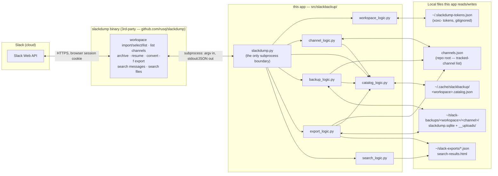

# DESIGN — Slack Archive Toolkit

## Solution Strategy

This is a local-only Python CLI (`./slackbackup`, package `src/slackbackup/`). There is no
server, no scheduled cloud job, and no GitHub Actions workflow — those were an earlier design
(see `git log` before the Python rewrite) and have been fully superseded. The only scheduling
that exists is operator-controlled: an optional nightly Windows Task Scheduler job
(`scripts/nightly-backup-digest.sh`) that just invokes the same CLI a human would type.

**This app never talks to the Slack API directly.** Confirmed by inspection — there is no
`requests`/`urllib`/`httpx` import anywhere in `src/slackbackup/`, and every Slack-facing
operation is a subprocess call to the third-party `slackdump` binary, all of them funneled
through one module, `src/slackbackup/slackdump.py` ("every call to the binary in this project
goes through here" — its own docstring). If a future change needs a new Slack capability, it
either already exists as a `slackdump` subcommand, or it's out of scope until `slackdump` adds
it — this project does not implement its own Slack API client.

What `slackdump` (the binary) owns, end to end:
- Authentication/session handling (`workspace import`, browser cookie + per-workspace token).
- Talking to the real Slack Web API: pagination, rate-limit backoff/retry, the wire format.
- Per-channel durable storage: its own `slackdump.sqlite` archive format, and the incremental
  `archive`/`resume` lifecycle (see Known Gaps in `docs/references/slackdump-cli-notes.md` for
  the two confirmed footguns: `resume -dedupe` deletes thread-root rows, and `archive` over an
  *existing* directory duplicates data — both are why this app's own orchestration logic exists,
  see Building Block View).
- Rendering an archive to the documented, stable **Slack Export** JSON format (`convert -f
  export`) and to channel/message listings (`list channels`, `search messages`, `search files`).

What this app adds on top — all pure Python, zero Slack API calls of their own, operating only
on `slackdump`'s output and on small JSON files this app maintains itself:
- **Channel tracking** (`channel_logic.py`) — `channels.json` is a deliberately minimal join-key
  list (`{id, name, workspace}`); decides whether to register one channel by exact name, or to
  bulk-discover every new public channel matching a glob across a workspace glob
  (`register_matching`), filtering out private/archived/`shuttered*`-named channels.
- **Catalog** (`catalog_logic.py`) — a persistent, refreshable cache over `slackdump list
  channels`, two-tier (cheap member-only vs. expensive full), storing both Slack-mirrored fields
  (description, creator, created, is_private, is_archived) and two fields this app derives and
  owns outright: `registered_at` (when *we* started tracking a channel) and `last_posted` (the
  real last-message timestamp, only ever set once a backup actually finds message data).
- **Backup orchestration** (`backup_logic.py`) — decides `archive` vs. `resume` per channel from
  *local* state (does a non-empty local archive already exist), auto-heals a channel stuck on an
  unresumable empty archive (wipe + fresh `archive`, never `archive`-over-existing per the
  documented footgun above), and processes a multi-channel run most-recently-active-first. A
  **tiered cadence filter** (`should_check_tonight`, table `BACKUP_CADENCE_TIERS`) then skips
  dormant/empty channels on non-due nights: cadence is keyed off `last_posted` age (active nightly,
  older tiers every 2–10 days), staggered by a stable hash of the channel id so a tier never all
  fires on one night, with `last_checked` as a downtime backstop. Skips are a pure catalog lookup —
  the channel's sqlite is never opened. Safe because the max 10-day cadence sits far inside Slack's
  ~90-day retention. `-full` bypasses the filter entirely.
- **Export pipeline** (`export_logic.py`) — read-only products built from the archive + catalog,
  detailed in `docs/DESIGN-export.md`: bounded per-channel-month JSON, a cross-workspace digest
  (with per-channel context and non-image file/Canvas content pulled in), a full user-profile
  roster, and operator-owned report jobs (`--jobs`). F3-specific leadership tagging is delegated
  to a pluggable handler (`handlers/`), keeping the engine general-purpose.
- **Untracked-channel digest** (`channel_digest_logic.py`) — an on-demand tool that archives
  channels by glob and writes a merge-aware JSON digest of surviving messages/files/orphaned
  Canvases, for content outside `channels.json` — see `docs/DESIGN-files.md`. Not in the nightly
  cadence.
- **Search** (`search_logic.py`) — the one capability that *does* make a live call per
  invocation (`slackdump search messages`), rendered to one HTML report.

This project's git history was squashed to a single initial commit before going public, to avoid
publishing now-removed `channels-T*.txt` files that mapped DM channel IDs to user IDs (mild PII).
The repo and its issue tracker (`bd`) otherwise keep full normal history from that point forward.

---

## Data Flow

Reading this diagram: every arrow that touches `API` passes only through the `slackdump`
binary — no module in `App` ever points at `Slack` directly. `slackdump.py` is the single choke
point between this app and the binary; every other module calls *it*, never the binary directly
(enforced by convention, not code — see `catalog_logic.py`'s own docstring: "No code outside
this module should call `slackdump.list_channels()` directly," and the same pattern holds for
every other `slackdump.*` function).

---

## Building Block View

### Level 1 — Module responsibilities

| Module | Responsibility | Calls `slackdump.py`? |
|--------|----------------|------------------------|
| `slackdump.py` | Sole subprocess boundary to the `slackdump` binary. Every other module calls *this*, never `subprocess` directly. | — (is the boundary) |
| `workspace_logic.py` | Registers a workspace session: looks up its `xoxc-` token in `~/.slackdump-tokens.json`, combines with a freshly-pasted `xoxd-` cookie, hands both to `slackdump workspace import`. | Yes |
| `channel_logic.py` | `channels.json` load/save/validate; single-channel registration by exact name (via the catalog); bulk glob- or comma-list-based discovery of new public channels (`register_matching`) with private/archived/`shuttered*` filtering; stamps `registered_at` in the catalog the moment a channel is first tracked. | No (via `catalog_logic`) |
| `catalog_logic.py` | Owns the only call site for `slackdump.list_channels()`. Two-tier cache (fast member-only / expensive full) persisted to `~/.cache/slackbackup/<workspace>.catalog.json`. Also owns `registered_at`/`last_posted`/`effective_recency` — fields with no Slack-API source at all, purely this app's own bookkeeping. | Yes |
| `backup_logic.py` | Per-channel `archive`-vs-`resume` decision from local archive state; empty-archive auto-heal; updates `last_posted` after a successful backup that found data; orders a multi-channel run by `effective_recency`; tiered cadence filter (`should_check_tonight`) that skips not-due dormant/empty channels and records `last_checked`/`last_action`; timestamped logging + run summary. | Yes |
| `export_logic.py` | Read-only derived products from the archive + catalog (see `docs/DESIGN-export.md`): bounded monthly export, cross-workspace digest, user-profile roster, and report-job (`--jobs`) loading/path-templating. General-purpose: all F3-specific leadership logic is delegated to a pluggable handler (`handlers/`), not inline. Reads `slackdump.sqlite` directly only for the `FILE` table (channel-level files/Canvases have no message anchor and never appear in the message-export); everything else goes through the documented `convert -f export` boundary. | Yes (`convert_export` only) |
| `handlers/` (`__init__.py`, `f3.py`) | Region/workspace-specific digest processing pulled out of `export_logic.py`. `f3.py` holds every F3 title/role regex + leadership rollup behind a two-function protocol (`annotate_profile`, `build_leadership`); `__init__.py` is the registry (`get`/`NAMES`). Selected via `export digest --leadership-handler` or a job's `leadership_handler` field — see `docs/DESIGN-export.md`. | No |
| `channel_digest_logic.py` | On-demand `channel-digest run`: archives channels matching an fnmatch glob (e.g. `shuttered-*`, untracked) and writes/merges a schema-versioned (`slack-channel-digest-v2`) JSON of surviving messages/files/orphaned Canvases — for recovering content outside `channels.json`. Not in the nightly cadence — see `docs/DESIGN-files.md`. | Yes (`archive` + `convert_export`) |
| `search_logic.py` | Cross-workspace live message search → one HTML report. The only capability that makes a real API call on every invocation, no caching. | Yes |
| `files_logic.py` | Summarizes an existing `index.json`. The producers (`files fetch`/`files index`) are **not yet ported** — see `docs/DESIGN-files.md` — this module only consumes whatever schema they'd produce. | No |
| `selector_logic.py` | Shared comma-separated-list + glob matching (`matches_selector`/`split_selector_list` for workspace/channel selectors; `expand_path_selector` for `--jobs` filesystem-path expansion). | No |
| `cli.py` / `backup.py` / `channel.py` / `catalog.py` / `export.py` / `search.py` / `workspace.py` / `files.py` / `channel_digest.py` | Argparse wiring only — each non-`*_logic.py` module registers its subcommands and translates CLI args into a `*_logic` call. No business logic lives here. | No |

### Level 2 — Local storage

| Location | Owner | Contents | Disposable? |
|----------|-------|----------|-------------|
| `~/.slackdump-tokens.json` | Operator (manual) | `{workspace: xoxc-token}` — gitignored, lives outside the repo | No — re-acquiring a token is a manual browser step |
| `channels.json` (repo root) | `channel_logic.py` | `[{id, name, workspace}, ...]` — the tracked-channel list, intentionally minimal | No — this *is* the configuration |
| `~/.cache/slackbackup/<workspace>.catalog.json` | `catalog_logic.py` | Per-channel: member/name/description/is_private/is_archived/creator/created (Slack-mirrored) + registered_at/last_posted/last_checked/last_action (this app's own) | **Yes** — deleting it just forces a rebuild via `list channels` on next use; `registered_at`/`last_posted`/`last_checked` history is lost (cadence resets to "check everything once"), not catastrophic |
| `~/slack-backups/<workspace>/<channel>/slackdump.sqlite` (+`__uploads/`) | `slackdump` binary, orchestrated by `backup_logic.py` | The durable source of truth — full message history + downloaded file blobs | **No** — this is the actual backup; nothing else replaces it |
| `~/slack-exports/*.json`, `search-results.html` | `export_logic.py` / `search_logic.py` | Fully derived, regenerable any time from the archive + catalog | Yes — pure output, never read back as input |

---

## Known Gaps & Recommendations

| Gap | Assessment | Recommendation |
|-----|-----------|-----------------|
| `files fetch`/`files index` not ported to Python | Designed in `docs/DESIGN-files.md`, implemented as shell (`scripts/fetch-files.sh`, `scripts/build-file-index.sh`) but never ported — `files.py`'s handlers still raise `NotImplementedError`. | Port when the cross-channel file-harvesting use case is actually needed; `files_logic.py`'s `summarize()` already works against whatever `index.json` they'd produce. |
| What happens if `archive` is killed mid-fetch is unverified | Each channel's own state is self-healing across a clean stop/restart (idempotent per-channel archive/resume), but an interrupted `archive` call's partial-write behavior hasn't been tested against the real binary. | Worth a real test before relying on "Ctrl-C anytime" as a hard guarantee for a long multi-channel `backup run`. |
| No alerting on a failed unattended run | The nightly Windows Task Scheduler job logs to `~/slack-backups/nightly.log`, but nothing notifies the operator if it fails — failure is silent until someone checks. | Add a simple failure notification (e.g. a check that fails loudly, or a notification step) if unattended reliability becomes a real concern. |

---

## References

| Document | Covers |
|----------|--------|
| `docs/CONTEXT.md` | Purpose, capabilities, use cases, non-goals |
| `docs/DESIGN-export.md` | `export monthly`/`export digest`/`export users` — schemas, sealing, leadership inference, file content extraction |
| `docs/DESIGN-files.md` | Channel catalog (implemented) + Canvas/file harvesting (designed, not yet ported) |
| `docs/references/slackdump-cli-notes.md` | slackdump CLI behavior/cost/gotchas confirmed empirically — read before re-deriving anything about how slackdump itself behaves |
| slackdump | https://github.com/rusq/slackdump — CLI flags, auth, output formats |
