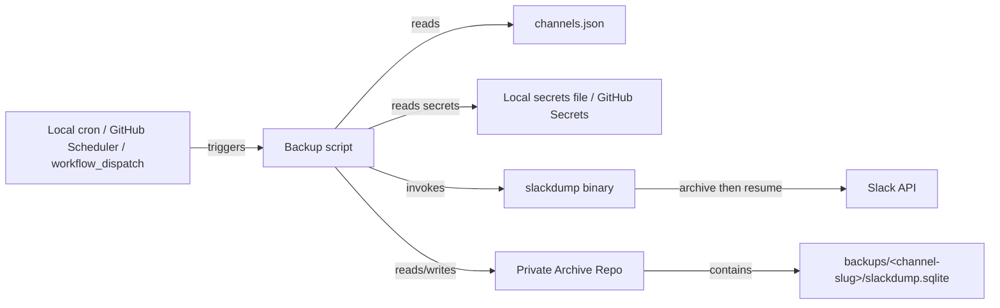
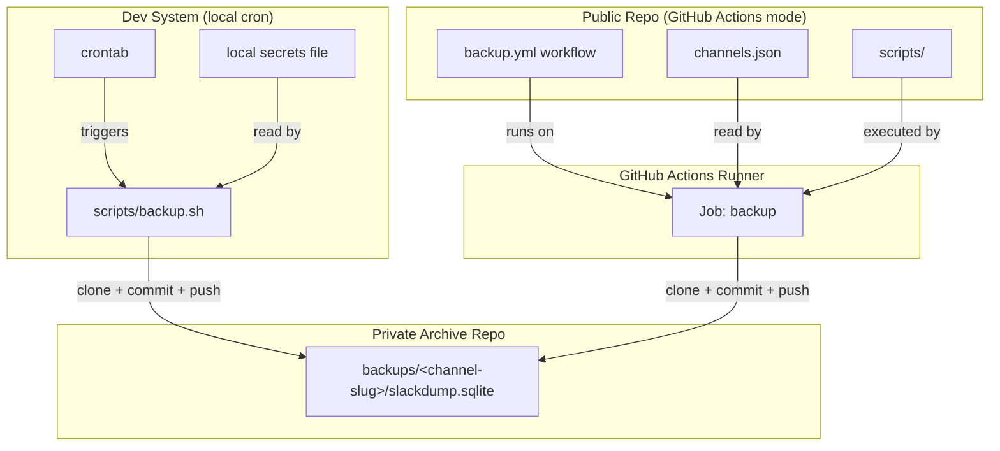

# DESIGN — Slack Backup

## Solution Strategy

The backup logic in `scripts/` is trigger-agnostic and supports two trigger modes sharing the same code path:

1. **Local cron** — invoked directly on the dev system via crontab/scheduled task. No GitHub Secrets, no GitHub Actions minutes consumed, and immune to GitHub's 60-day scheduled-workflow dormancy rule (see Known Gaps below). Credentials come from a local secrets file (not committed) instead of GitHub Secrets.
2. **GitHub Actions** — a `schedule:` cron trigger (plus manual `workflow_dispatch` for full re-sync) runs the same scripts on a GitHub-hosted runner, free and forkable with no external infrastructure. Credentials come from GitHub repository secrets, injected as env vars.

Both modes write to the same private archive repo. **Build order: local cron first.** The scripts are implemented and validated as a plain local invocation before `.github/workflows/backup.yml` is written — GitHub Actions wraps the proven local logic rather than being where the logic is first built and debugged (see `SlackBackup-90o`, `SlackBackup-dj8`).

GitHub itself, when the GitHub Actions trigger is used, is also the storage backend: the fetched data is committed straight into a private GitHub repo — no server or third-party storage to provision either way. slackdump handles Slack export via browser session cookies, eliminating the need for OAuth apps or admin tokens. Splitting configuration into a public repo and backup output into a private repo isolates credentials without complicating the fork workflow.

Storage format is slackdump's native **archive** format — one `slackdump.sqlite` database per channel — using slackdump's own `resume` command for incremental updates, rather than a custom NDJSON-append + `last_ts.txt` scheme. This was validated by spike `SlackBackup-d3r`: a real archive-then-resume cycle against a test channel confirmed `resume` correctly fetches only new activity, but also surfaced a confirmed data-loss bug in the `-dedupe` flag (it deletes thread-root message rows — see Known Gaps). Decision: use `resume` without `-dedupe`; accept occasional duplicate rows across resume cycles rather than risk silently losing thread structure.

This project's scope is extraction and durable storage only — see CONTEXT.md Non-Goals. Search and analysis of the archived data are explicitly out of scope and left to a later, separate project.

---

## Runtime Architecture

---

## Building Block View

### Level 1 — System Overview

| Component | Responsibility |
|-----------|---------------|
| `scripts/backup.sh` | Core trigger-agnostic logic: reads `channels.json`, archives or resumes each channel via slackdump, commits/pushes to the archive repo. Invoked directly by local cron, or wrapped by the GitHub Actions workflow. |
| `.github/workflows/backup.yml` | (Built after local validation, `SlackBackup-dj8`) GitHub Actions trigger + secret injection wrapping `scripts/backup.sh` |
| `channels.json` | Declares channel IDs and slugs; sole configuration source for which channels are backed up |
| `scripts/install-slackdump.sh` | Downloads and verifies the slackdump binary at a pinned version |
| Private archive repo | Stores one `slackdump.sqlite` archive per channel; never cloned publicly; accessed via PAT (GitHub Actions mode) or local git credentials (local cron mode) |

---

## Deployment View

---

## Crosscutting Concepts

### Secrets Management

Credentials differ by trigger mode but are never written into the archive repo in either case:
- **GitHub Actions mode**: credentials stored as GitHub repository secrets on the public repo, base64-encoded session file, injected as environment variables into the workflow job.
- **Local cron mode**: credentials stored in a local secrets file outside the repo (not committed), readable only by the invoking user; slackdump's own per-workspace credential store (`~/.cache/slackdump`) handles the session itself once `workspace new` has been run interactively.

### State Management

Each channel's archive is a single `slackdump.sqlite` database (slackdump's native **archive** format), stored in the private archive repo at `backups/<channel-slug>/slackdump.sqlite`. Absence of the file triggers `slackdump archive` (full fetch) on first run. On subsequent runs, `slackdump resume <path>` (without `-dedupe` — see Known Gaps) fetches only new/changed activity since the last archive. There is no separate timestamp-tracking file; the database itself is the state.

### TDD Test Plan

**E2E Acceptance Tests** — run against the real slackdump binary and a real disposable test channel, not a stub (DevStandard T14):
1. Incremental logic (UC-1, `SlackBackup-4a8`): `archive` then `resume` a real test channel; verify only new messages are added and no existing messages are lost or duplicated.
2. Full re-sync (UC-2, `SlackBackup-03m`): verify `archive` (ignoring any prior state) reproduces full channel history.
3. Idempotency / partial-failure recovery: run the backup twice in sequence, including one run interrupted mid-write, against the real test channel; assert no duplicate or missing messages (T8/T22 — see Known Gaps).

**Fixture-based tests** (no external boundary, real-channel realism not required):
4. Multi-channel (UC-3, `SlackBackup-c86`): verify exactly N archive files are created/updated for an N-channel `channels.json`.
5. Commit/push: verify git detects changes and pushes to the archive repo.

**Unit Tests** (`scripts/`, `SlackBackup-jcf`):
1. `parse_channels`: validate channels.json schema — array of objects with `id` (string) and `name` (string) fields.

---

## Known Gaps & Recommendations

Identified during a design review against `../DevStandard` SDLC/ATDD standards and the current (v4.4.0) capabilities of slackdump. Scoped to the project's actual goal — reliable, lossless extraction and storage; search/analysis is out of scope (see CONTEXT.md Non-Goals).

### P1 — Address before further implementation

| Gap | Assessment | Recommendation |
|-----|-----------|-----------------|
| Bespoke incremental logic duplicates a slackdump built-in | slackdump natively supports resuming a previous archive (adding only new messages), built for the exact 90-day free-workspace constraint this project targets. The original `scripts/incremental-dump.sh` + `last_ts.txt` design reimplemented that logic in custom shell. | **Resolved.** `SlackBackup-d3r` spike confirmed native `archive`/`resume` covers UC-1/UC-2; `SlackBackup-4i2` (custom logic) closed as superseded. The spike also surfaced a real bug: `resume -dedupe` deletes thread-root message rows (verified by diffing against an independent fresh archive — 9/9 thread parents missing). Decision: use `resume` without `-dedupe`. |
| E2E test plan mocks the external boundary | DESIGN.md's TDD Test Plan stubs slackdump for E2E tests. DevStandard `sdlc-testing-principles.md` T14 prohibits mocking external platform boundaries — for a tool whose only job is "don't lose messages," the real slackdump↔Slack API boundary is exactly the thing that must be exercised for real. | **Resolved in design.** TDD Test Plan above now specifies real slackdump + a real disposable test channel for UC-1/UC-2; the spike itself demonstrated why — the `-dedupe` bug was only visible against real data, a stub would have hidden it entirely. |
| No idempotency / partial-failure-recovery test coverage | Rerunning after a partial failure is the actual data-loss scenario this project exists to prevent, per T8 (idempotency) and T22 (risk-ordered coverage). | **Resolved in design.** TDD Test Plan above adds an explicit idempotency/partial-failure scenario (item 3). |
| Twin-track lifecycle (I2) not reflected in bd issues | All 9 open issues have empty descriptions/acceptance criteria and are sequenced waterfall-style (red-phase test issues block implementation issues) rather than DevStandard's twin-track `[IMP]`/`[TST]` pairs built in parallel against a shared pre-code contract (I4). | Add the I4 contract (entry-point signature, completion signal, output schema) to each issue's description before claiming it; restructure as parallel `[IMP]`/`[TST]` pairs if continuing to follow the framework strictly. |
| No ADRs recorded | `docs/adr/` is empty. Of the three candidate decisions, only the **public/private repo credential split** clearly earns an ADR on its own (real security tradeoff, costly to silently violate later). NDJSON-format-no-conversion is pending the `SlackBackup-d3r` spike outcome; wiz-only auth is a direct consequence of the "no admin access" constraint already in CONTEXT.md and would mostly restate it. | Hold off on ADRs until the spike resolves; reconsider whether an ADR is worth the overhead at all for a project this size, versus the credential-split ADR being the one clear exception. |

### P2 — Operational risks, lower urgency

| Gap | Assessment | Recommendation |
|-----|-----------|-----------------|
| No failure-alerting use case | Quality Goal #1 promises "no silent data loss," but slackdump's session cookie will eventually expire or be revoked (password change, periodic re-auth), and a scheduled job that just logs and exits on auth failure is silent from the operator's perspective. | Add a UC/AC: operator is notified (e.g. failed-run GitHub notification, or a check that fails loudly) when a scheduled run fails, not just "failure is logged." |
| GitHub Actions disables idle scheduled workflows | GitHub auto-disables `schedule:`-triggered workflows after 60 days with no repo activity — a real risk for a low-traffic personal fork. "Activity" is not human login — confirmed (GitHub Discussions, community reports) to mean repo-level events: commits/pushes, PRs, and issues. A second, independently-active GitHub project can keep this repo alive by using a PAT to push a real commit (or open/close an issue) on a schedule, which resets the clock. A *self-referencing* keepalive schedule in the same repo does not reliably bootstrap itself — if this repo's own scheduled triggers are ever disabled, that keepalive schedule is disabled along with everything else, so the reset has to come from outside. | **Resolved by design:** local cron is now a first-class trigger mode (see Solution Strategy), not a fallback — it sidesteps the rule entirely since there's no GitHub-side schedule to disable. GitHub Actions remains a second, redundant trigger mode built after the local path is proven. Document the dormancy constraint in OPERATIONS.md once written, for anyone relying on the GitHub Actions mode alone. |
| `docs/OPERATIONS.md` does not exist yet | Failure modes, recovery procedures, and the alerting/dormancy items above have no home yet. | Create `docs/OPERATIONS.md` per this project's document map before implementing UC-1, so failure-mode behavior is specified alongside the happy path rather than added after the fact. |

---

## References

| Document | Location | Covers |
|----------|----------|--------|
| slackdump | https://github.com/rusq/slackdump | CLI flags, wiz auth, output format |
