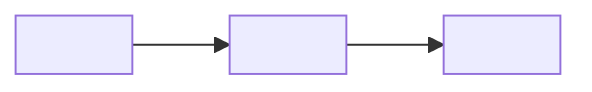
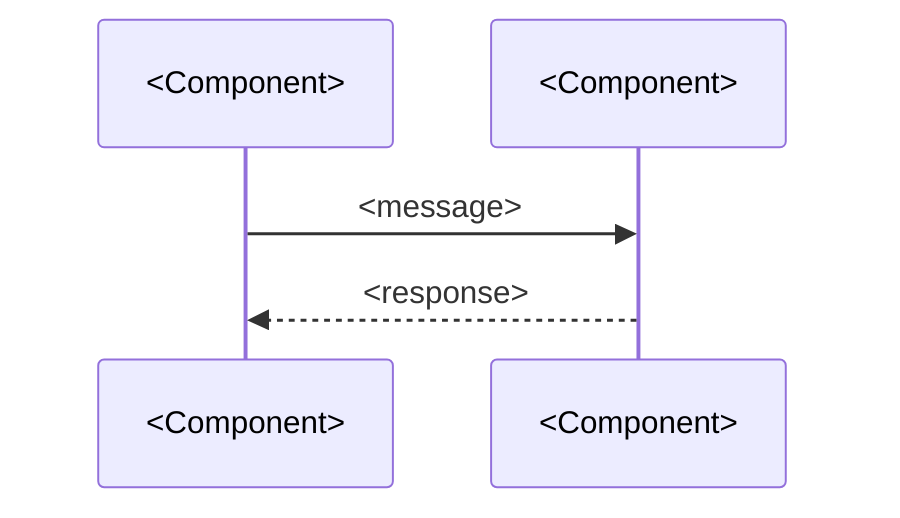
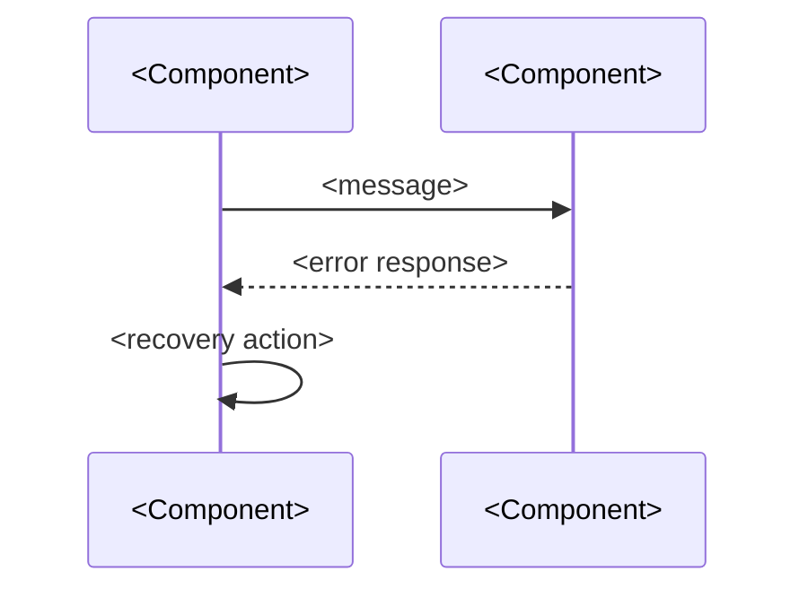
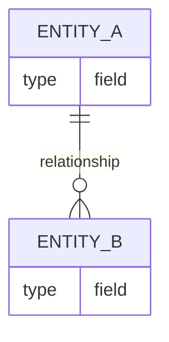

# DESIGN — <Project Name>

## Solution Strategy
[If applicable — include when architecture involves non-obvious choices]
<!-- Extended: required — covers technology choices, decomposition rationale, quality goal mapping -->
<Summary of fundamental decisions and approaches that shaped this architecture.
Why is it structured the way it is? What technology choices were made and why?
How does the architecture address the top quality goals?>

---

## Runtime Architecture
<How the system operates at runtime. Components, responsibilities, communication.>



---

## Building Block View

### Level 1 — System Overview
<Top-level decomposition. Major subsystems or components and their responsibilities.>

| Component | Responsibility |
|-----------|---------------|
| <Component> | <What it does> |
[If applicable] | <Component> | <What it does> |

### Level 2 — Component Detail
[If applicable — include for components complex enough to warrant it]
<Internal structure of level-1 components where detail matters.>

### Level 3+
<!-- Extended only — use sparingly, only when Level 2 is insufficient -->
[If applicable]
<Use sparingly. Prefer relevance over completeness.>

---

## Runtime View
[If applicable — include when error or exception flows are non-obvious]
<!-- Extended: required; use named scenario headings -->

<!-- Standard version: prose + optional diagram -->
<Key runtime scenarios showing how components interact under normal and error conditions.>

[If applicable]


<!-- Extended version (replace above with named scenarios):
### Scenario: <Normal Flow Name>


### Scenario: <Error or Exception Flow>
[If applicable]

-->

---

## Deployment View
[If applicable — include when deployment is non-trivial or involves multiple environments]
<!-- Extended: required -->
<How the system is deployed. Infrastructure, environments, and component mapping.>

[If applicable]
```mermaid
graph TD
    subgraph <Environment>
        A[<Component>]
        B[<Component>]
    end
    A --> B
```

<!-- Extended: add environment matrix when multiple environments exist
| Environment | Purpose | Components Deployed |
|-------------|---------|-------------------|
| <e.g. Production> | <Live system> | <Components> |
| <e.g. Staging> | <Pre-release testing> | <Components> |
-->

---

## Crosscutting Concepts
[If applicable — include when patterns or rules apply across multiple components]
<!-- Extended: required -->

### <Concept e.g. Error Handling>
<How this concern is addressed consistently across the system.>

[If applicable]
### <Concept e.g. Logging>
<Approach and standards.>

<!-- Extended: add Security, Audit as applicable
### <Concept e.g. Security>
<Authentication, authorization, data protection approach.>
-->

---

## Data Model
[If applicable]
<Key data structures and their relationships.>

[If applicable]


---

## Dependency Rules
[If applicable]
- <e.g. Modules may not import from sibling modules — only from shared/>
- <e.g. External I/O is isolated to the adapters layer>

---

## References
[If applicable]
| Document | Location | Covers |
|----------|----------|--------|
| <Document name> | <assets/ path or URL> | <What it covers> |
