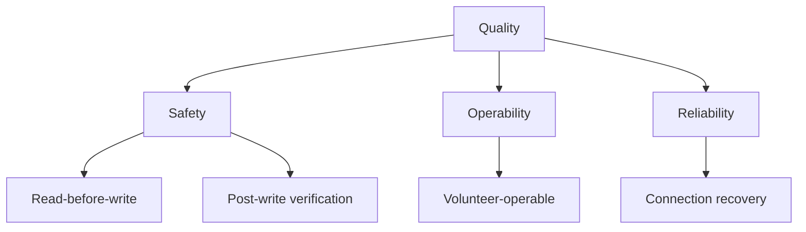

# QUALITY — <Project Name>

<!-- Extended tier only. Not present in Standard or Minimal. -->
<!-- Quality Goals are defined in CONTEXT.md §Introduction & Goals. -->
<!-- This document provides testable detail for each quality goal. -->

---

## Quality Tree
<High-level overview of quality attributes and their priority relationships.
Leaf nodes correspond to quality scenarios below.>

---

## Quality Scenarios

Quality scenarios follow this format:
- **Source:** who or what initiates the stimulus
- **Stimulus:** the event that occurs
- **Environment:** system state at the time
- **Response:** what the system does
- **Measure:** how we know the response is adequate

### QS-1: <Scenario Name — maps to Quality Goal priority 1>

| Attribute | Value |
|-----------|-------|
| Source | <e.g. Operator> |
| Stimulus | <e.g. Initiates write of 50 parameters> |
| Environment | <e.g. Normal operation, device connected> |
| Response | <e.g. System reads current values, computes diff, writes only changed values, verifies post-write> |
| Measure | <e.g. No parameter written without prior read; all writes verified within 500ms> |

### QS-2: <Scenario Name>
[If applicable]

| Attribute | Value |
|-----------|-------|
| Source | |
| Stimulus | |
| Environment | |
| Response | |
| Measure | |

---

## Risks and Technical Debt

### Known Risks
| # | Risk | Probability | Impact | Mitigation |
|---|------|-------------|--------|------------|
| R-1 | <Risk description> | High/Med/Low | High/Med/Low | <Mitigation approach> |
[If applicable] | R-2 | <Risk> | | | |

### Technical Debt
| # | Item | Area | Impact | Plan |
|---|------|------|--------|------|
| D-1 | <Debt item> | <Area> | <Impact if unaddressed> | <Plan or timeline> |
[If applicable] | D-2 | | | | |
