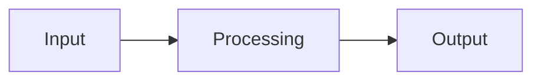

# <Tool Name>

> **Scale note:** This project uses a condensed single-file documentation structure.
> See CLAUDE.md §Scaling Threshold for when and how to expand to the Standard tier.

<One sentence description of what this tool does.>

---

## CONTEXT — Why + What

### Introduction & Goals

**Purpose**
<Two to three sentences describing what this tool does and why it exists.>

**Quality Goals**
[If applicable]
| Priority | Quality Goal | Scenario |
|----------|-------------|----------|
| 1 | <e.g. Safety> | <e.g. No write operation occurs without prior read verification> |
| 2 | <e.g. Operability> | <e.g. A non-technical volunteer can operate the system> |

**Stakeholders**
[If applicable]
| Stakeholder | Expectation |
|-------------|-------------|
| <e.g. Developer> | <e.g. Fast context reload after a break> |
| <e.g. Operator> | <e.g. Clear error messages and recovery steps> |

---

### Constraints

**Technical Constraints**
[If applicable]
- <e.g. Python 3.11+ required>
- <e.g. Must operate without internet access>

**Organizational Constraints**
[If applicable]
- <e.g. Single developer, no external dependencies requiring licenses>

**Regulatory Constraints**
[If applicable]
- <e.g. Must comply with X standard>

---

### Capabilities
- <Durable capability — not sprint story>
- <Durable capability>
[If applicable] - <Additional capability>

---

### Use Cases
[If applicable — include if the tool has distinct actor-driven flows]
<!-- Use standard UC format from doc-standard.md -->

#### UC-1: <Short Name>

Actor: <Primary actor>

Preconditions:
- <Condition>

Primary Flow:
1. <Step>
2. <Step>

Postconditions:
- <Resulting system state>

Constraints:
- <Invariant>

---

### Non-Goals
- <What this tool explicitly does not do>
[If applicable] - <Additional non-goal>

---

### Glossary
[If applicable]
| Term | Definition |
|------|------------|
| <Term> | <Definition> |

---

## DESIGN — How

### Solution Strategy
[If applicable — include when the architecture involves non-obvious decisions]
<Short summary of the fundamental decisions that shaped this tool's design.
Why is it structured the way it is? What alternatives were rejected?>

---

### Runtime Architecture
<Brief description of how the tool operates at runtime.>

[If applicable]


---

### Building Block View
<Description of the one or two modules and what each is responsible for.>

[If applicable]
| Module | Responsibility |
|--------|---------------|
| <module> | <what it does> |

---

### Runtime View
[If applicable — include if error or exception flows are non-obvious]
<Key runtime scenarios: how does the tool behave under normal and error conditions?>

---

### Data Model
[If applicable]
<Description of key data structures.>

---

### References
[If applicable]
| Document | Location | Covers |
|----------|----------|--------|
| <Document name> | <assets/ path or URL> | <What it covers> |

---

## OPERATIONS — Run + Recover

### Deployment
<How this tool is installed and where it runs. Single sentence if simple.>

### Development Environment
[If applicable — include when local setup is not obvious from package config alone]
**Setup:**
```bash
python -m venv .venv
source .venv/bin/activate      # Linux / macOS
.venv\Scripts\activate         # Windows
pip install -e ".[dev]"
```

**Verify:**
```bash
<command that confirms environment is working>
```

[If applicable] See CONTRIBUTING.md for OS-specific or IDE-specific variations.

---

### Configuration

**Environment Variables**
[If applicable]
| Variable | Required | Default | Description |
|----------|----------|---------|-------------|
| <VAR_NAME> | Yes/No | <default> | <description> |

**Configuration File**
[If applicable]
<Location, format, and key options.>

---

### Running
```bash
<command to run the tool>
```
<Any required arguments or flags.>

---

### Failure Modes
[If applicable]
| Failure | Symptom | Recovery |
|---------|---------|---------|
| <e.g. Connection refused> | <e.g. OSC timeout error> | <e.g. Verify device is powered and on network> |
