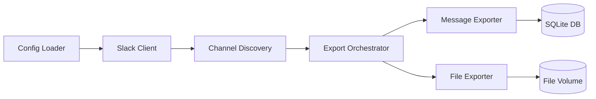
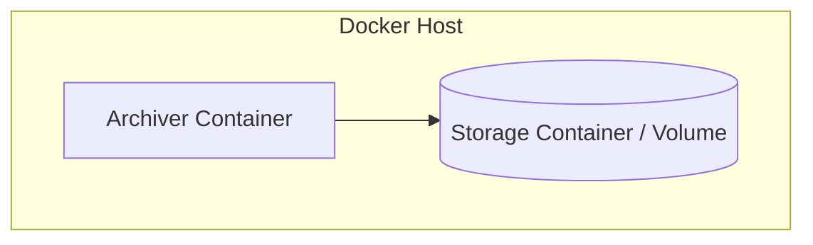

Here’s a first-pass architecture bundle you can drop straight into Claude Code and refine. I’ll give you:

- `CONTENTS.md` (workspace)
- `docs/CONTEXT.md` (archiver project, with use cases/requirements)
- `docs/DESIGN.md` (archiver project)
- `docs/OPERATIONS.md` (deployment + Docker)
- `docker-compose.yml` (three-container layout)

You can adjust names/paths to match your repo.

---

### 1. Workspace `CONTENTS.md`

```markdown
# Contents — Slack Archive Workspace

Workspace for bot-based Slack archiving: message/file capture, storage, and reporting.

---

## Sub-Projects

| Name              | Type   | Tier     | bd | Status  | Description                                      |
|-------------------|--------|----------|----|---------|--------------------------------------------------|
| `archiver/`       | app    | Standard | —  | active  | Bot-based Slack archiver (Slackdump-derived).    |
| `storage/`        | library| Minimal  | —  | active  | SQLite + filesystem storage for archives.        |
| `reporting/`      | app    | Standard | —  | draft   | Digest/report generator over archived data.      |

---

## Shared Resources

| Resource              | Location              | Used by              |
|-----------------------|----------------------|----------------------|
| Archive volume        | `data/` (Docker volume) | archiver, reporting |
| Schema definitions    | `storage/schema.sql` | archiver, reporting  |

---

## Dependency Chain

```
storage/   (foundational: DB + files)
    ↓
    └─→ archiver/   (writes messages/files into storage)
            ↓
            └─→ reporting/  (reads from storage to build digests)
```
```

---

### 2. Archiver `docs/CONTEXT.md`

```markdown
# CONTEXT — Slack Bot Archiver

## Introduction & Goals — Purpose

The Slack Bot Archiver captures all public messages and files from Slack workspaces
the bot is installed in, within Slack’s retention limits, and stores them in a
queryable archive for later reporting and analysis.

## Core Capabilities

- **Public Channel Archiving:** Capture messages from all channels the bot is a member of.
- **File Capture:** Download files shared in those channels and store them alongside metadata.
- **Incremental Export:** Run periodically, exporting only new messages/files since the last run.
- **Multi-Workspace Support:** Handle multiple workspaces via separate bot tokens/config entries.
- **Structured Storage:** Persist data into SQLite and filesystem for downstream tools.

## Non-Goals

- Archiving DMs or private channels where the bot is not a member.
- Bypassing Slack’s retention limits (e.g., 90-day window on free plans).
- Providing real-time analytics or monitoring dashboards (handled by reporting).

## Constraints — Technical

- Slack Free plan retention (~90 days) limits historical visibility.
- Slack Web API rate limits must be respected (429 + Retry-After).
- Bot tokens are long-lived but must be stored securely (env/secret).
- Storage backend initially SQLite + filesystem; single-writer assumption.

---

## Use Cases

### UC-1: Archive Public Channel Messages

Actor: Archiver service

Preconditions:
- Bot is installed in workspace with required scopes.
- Bot is a member of target public channels.
- Storage backend is reachable.

Primary Flow:
1. Discover channels where the bot is a member.
2. For each channel, fetch message history since last export.
3. Normalize and store messages in SQLite.
4. Update per-channel last-export timestamp.

Alternate Flows:
A1: Slack API returns rate-limit → archiver backs off and retries.
A2: Channel becomes archived → archiver skips further exports for that channel.

Postconditions:
- New messages are persisted with channel and timestamp metadata.

Acceptance Criteria:
- All messages visible to the bot in target channels are stored once.
- No duplicate messages for the same `channel + ts`.

Constraints:
- Must not exceed Slack rate limits; retries must respect Retry-After.

---

### UC-2: Archive Files Shared in Channels

Actor: Archiver service

Preconditions:
- UC-1 flow is active and messages are being fetched.
- Files are shared in channels the bot can read.

Primary Flow:
1. Identify file references in fetched messages.
2. For each new file ID, download via `url_private` using bot token.
3. Store file content in filesystem under workspace/channel path.
4. Store file metadata and local path in SQLite.

Alternate Flows:
A1: File download fails (network) → retry with backoff.
A2: File is no longer accessible (expired) → record failure in metadata.

Postconditions:
- Files are stored and linked to their messages via metadata.

Acceptance Criteria:
- Every accessible file referenced in messages is downloaded once.
- Missing/failed files are recorded with reason.

Constraints:
- File downloads must not leak bot token (no public URLs).

---

### UC-3: Incremental Scheduled Export

Actor: Scheduler (cron/Kubernetes/job)

Preconditions:
- UC-1 and UC-2 flows implemented.
- Last-export timestamps exist per channel.

Primary Flow:
1. Scheduler triggers archiver container on a fixed interval.
2. Archiver reads last-export timestamps.
3. Fetches only messages newer than last-export per channel.
4. Runs UC-2 for any new files.
5. Updates last-export timestamps.

Alternate Flows:
A1: Archiver run fails mid-way → partial data persisted; next run resumes.

Postconditions:
- Archive stays within Slack retention window, capturing all new public content.

Acceptance Criteria:
- No gaps in message timestamps within retention window.
- Re-running archiver does not re-import already stored messages.

Constraints:
- Interval must be short enough to avoid gaps due to retention (e.g., ≤24h).
```

---

### 3. Archiver `docs/DESIGN.md`

```markdown
# DESIGN — Slack Bot Archiver

## Solution Strategy

Reuse Slackdump’s proven export patterns (pagination, rate limiting, retries, file
download) while replacing the auth and discovery layer with a bot-token-based model.
The archiver runs as a containerized service, writing to a shared storage backend
(SQLite + filesystem) that reporting tools consume.

---

## Runtime Architecture

At runtime, the archiver:

- Loads workspace and channel configuration.
- Authenticates to Slack via bot token.
- Discovers channels where the bot is a member.
- Iterates channels, fetching message history with cursor-based pagination.
- Extracts file references and downloads files.
- Persists messages and files into storage.



---

## Building Block View — Level 1

| Component          | Responsibility                                      |
|--------------------|-----------------------------------------------------|
| Config Loader      | Read workspace/channel/export settings.             |
| Slack Client       | Wrap Slack Web API calls with auth + retries.       |
| Channel Discovery  | List channels where bot is a member.                |
| Export Orchestrator| Coordinate per-channel message/file export.         |
| Message Exporter   | Fetch and normalize messages; write to DB.          |
| File Exporter      | Download files; write to filesystem + DB metadata.  |
| Storage Adapter    | Provide DB/file operations to exporters.            |

---

## Runtime View

### Scenario: Scheduled Export Run

1. Scheduler starts archiver container.
2. Config Loader loads workspace configs.
3. Slack Client validates bot token (`auth.test`).
4. Channel Discovery lists channels and filters by membership.
5. Export Orchestrator loops channels:
   - Calls Message Exporter with `oldest=last_export_ts`.
   - Message Exporter paginates via `next_cursor`, writes to DB.
   - File Exporter downloads new files and writes to volume + DB.
6. Export Orchestrator updates `last_export_ts` per channel.

Error flow:
- On `429` from Slack, Slack Client reads `Retry-After`, sleeps, retries.
- On network/5xx errors, Slack Client uses exponential backoff and logs failures.

---

## Deployment View

The archiver runs as a Docker container in a workspace with shared storage.



- Archiver container mounts a shared volume (`data/`) for:
  - SQLite DB file (e.g., `data/archive.db`)
  - File blobs (e.g., `data/files/...`)

---

## Crosscutting Concepts

### Error Handling

- All Slack API calls go through Slack Client with:
  - Rate-limit detection (`429` + `Retry-After`).
  - Exponential backoff on transient errors.
  - Structured logging of failures.

### Logging

- Each export run logs:
  - Workspace ID, channel ID.
  - Message count, file count.
  - Rate-limit events and retries.
  - Failures with reasons.

---

## Data Model

### Messages

- `id` (internal)
- `workspace_id`
- `channel_id`
- `ts`
- `user_id`
- `text`
- `thread_ts` (nullable)
- `raw_json` (for completeness)

### Files

- `id` (Slack file ID)
- `workspace_id`
- `channel_id`
- `name`
- `mimetype`
- `size`
- `url_private`
- `local_path`
- `raw_json`

### Channel Export State

- `workspace_id`
- `channel_id`
- `last_export_ts`

---

## Dependency Rules

- Slack Client is the only component allowed to call Slack Web API.
- Export Orchestrator depends on Channel Discovery and Storage Adapter.
- Reporting tools depend only on Storage Adapter, not on Slack Client.
```

---

### 4. Archiver `docs/OPERATIONS.md`

```markdown
# OPERATIONS — Slack Bot Archiver

## Deployment

### Model

The archiver runs as a Docker container in a workspace alongside storage and reporting
containers. It mounts a shared volume for the SQLite DB and file blobs.

### Development Environment

**Setup:**
```bash
# Example for Go
go mod tidy
```

**Verify:**
```bash
go test ./...
```

### Installation

```bash
docker build -t slack-archiver ./archiver
docker build -t slack-storage ./storage
docker build -t slack-reporting ./reporting
```

### Environment Variables

| Variable              | Required | Default | Description                                  |
|-----------------------|----------|---------|----------------------------------------------|
| `SLACK_BOT_TOKEN`     | Yes      | —       | Bot token for the workspace.                 |
| `WORKSPACE_ID`        | Yes      | —       | Slack workspace ID.                          |
| `ARCHIVE_DB_PATH`     | No       | `data/archive.db` | SQLite DB path on mounted volume.   |
| `ARCHIVE_FILES_ROOT`  | No       | `data/files`      | Root directory for file blobs.      |
| `EXPORT_INTERVAL_MIN` | No       | `60`    | Suggested run interval in minutes (external scheduler). |

---

## Running

```bash
docker-compose up -d
```

Archiver runs either:

- As a one-shot job (triggered by scheduler), or
- As a long-lived service with internal loop.

### Running Tests

```bash
# Example
go test ./archiver/...
```

---

## Failure Modes

| Failure                          | Symptom                                  | Recovery                                      |
|----------------------------------|-------------------------------------------|-----------------------------------------------|
| Slack rate-limit (429)          | Logs show 429 + Retry-After              | Automatic backoff; verify interval not too tight. |
| Invalid bot token               | `auth.test` fails                         | Rotate token; update container env; restart.  |
| Storage volume unavailable      | DB/file write errors                      | Check Docker volume mount; restore and restart. |
| File download failure           | Missing file entries or error logs       | Investigate network; re-run archiver for affected window. |

---

## Recovery Procedures

### Partial Export Failure

1. Identify affected workspace/channel from logs.
2. Confirm DB entries for that channel’s last-export window.
3. Adjust `last_export_ts` backward if needed.
4. Re-run archiver for that workspace.

---

## Audit and Compliance

[If applicable later — e.g., if used for compliance archiving]
- Document retention policy for DB and files.
- Access controls for archive volume.
```

---

### 5. `docker-compose.yml` (three-container layout)

```yaml
version: "3.9"

services:
  storage:
    image: alpine:3.19
    container_name: slack-storage
    command: ["sh", "-c", "mkdir -p /data/files && tail -f /dev/null"]
    volumes:
      - slack-archive-data:/data

  archiver:
    build: ./archiver
    container_name: slack-archiver
    environment:
      - SLACK_BOT_TOKEN=${SLACK_BOT_TOKEN}
      - WORKSPACE_ID=${WORKSPACE_ID}
      - ARCHIVE_DB_PATH=/data/archive.db
      - ARCHIVE_FILES_ROOT=/data/files
    volumes:
      - slack-archive-data:/data
    depends_on:
      - storage

  reporting:
    build: ./reporting
    container_name: slack-reporting
    environment:
      - ARCHIVE_DB_PATH=/data/archive.db
      - ARCHIVE_FILES_ROOT=/data/files
    volumes:
      - slack-archive-data:/data
    depends_on:
      - storage

volumes:
  slack-archive-data:
    driver: local
```

---

If you want, next step could be a more detailed data schema (`schema.sql`) or a test model aligned with your SDLC testing principles.